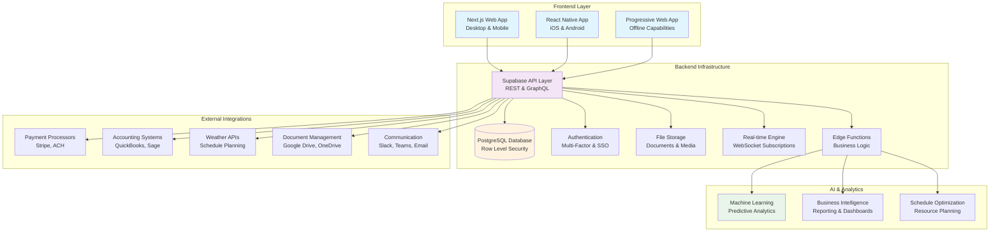
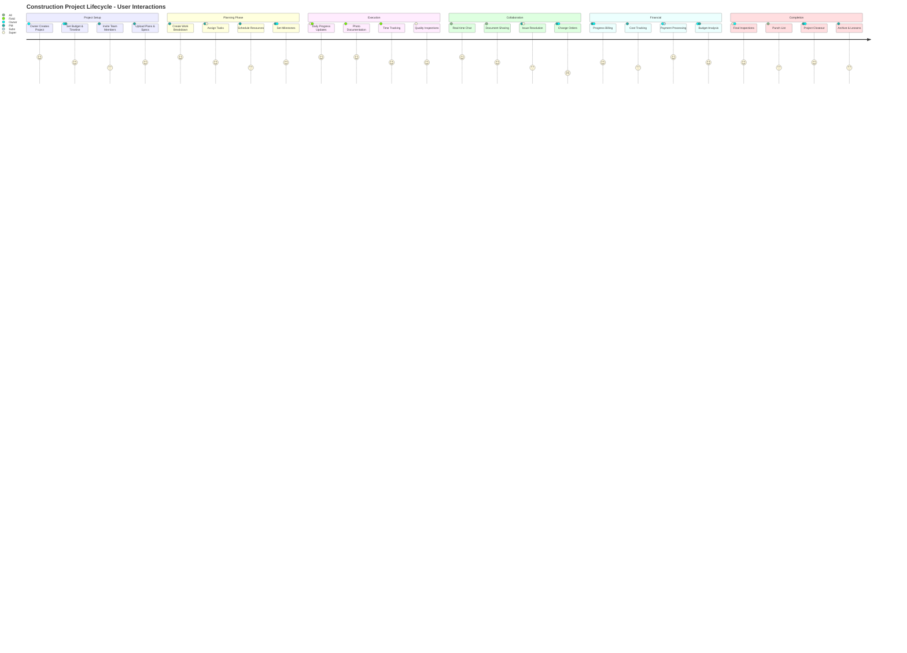
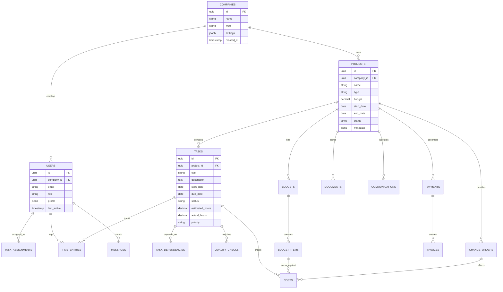
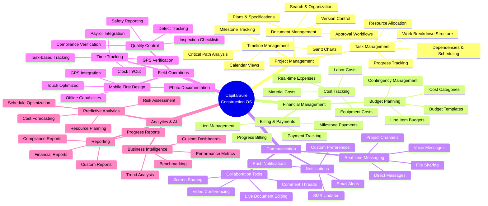
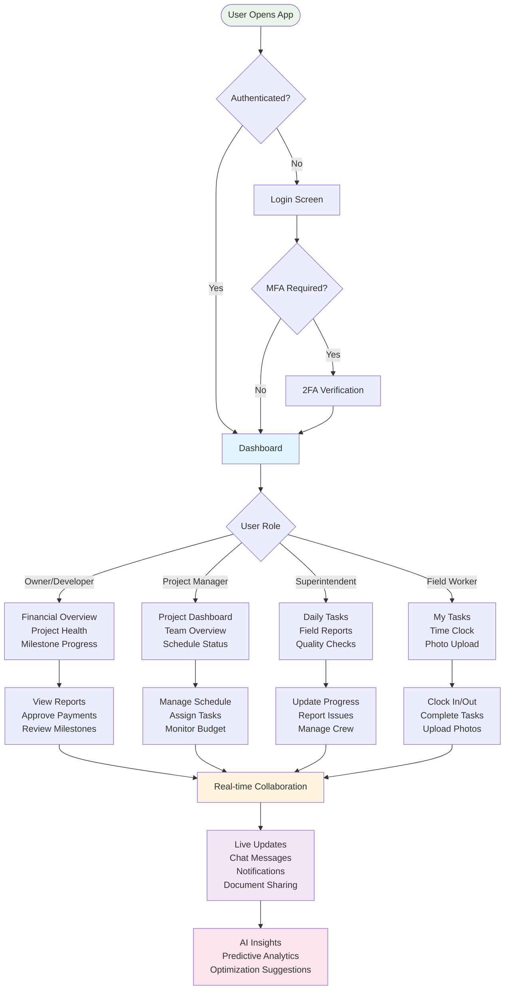
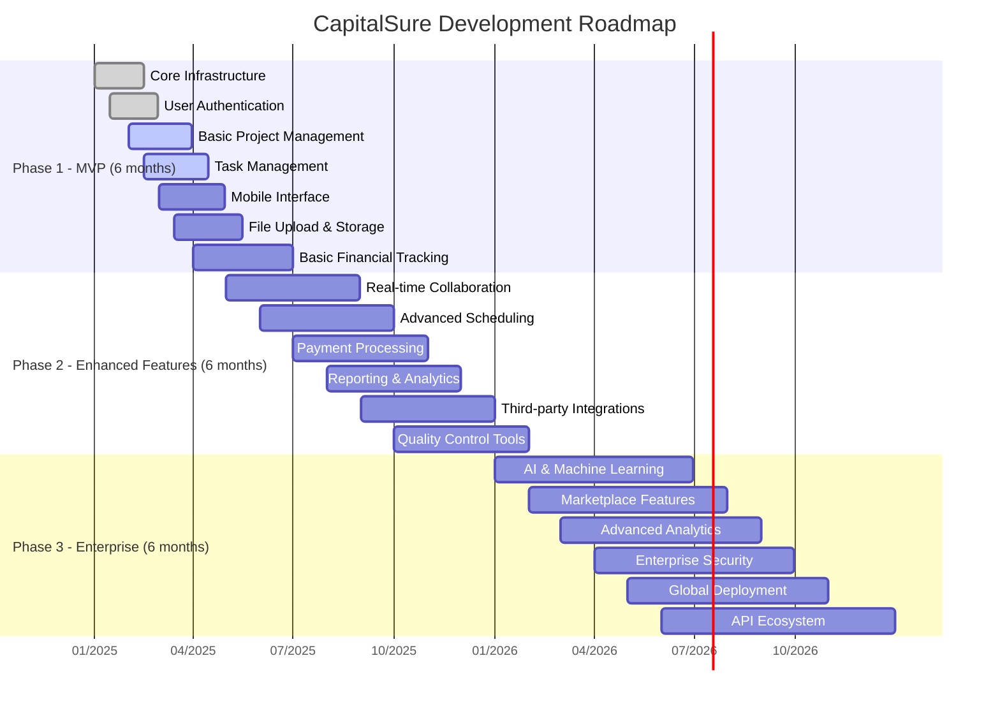
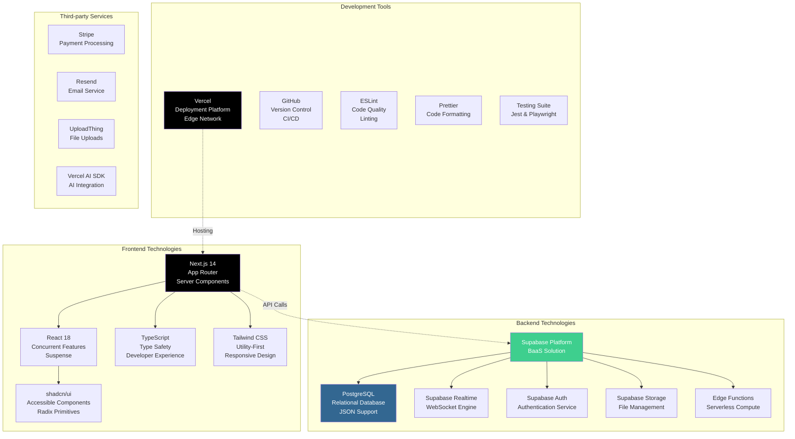
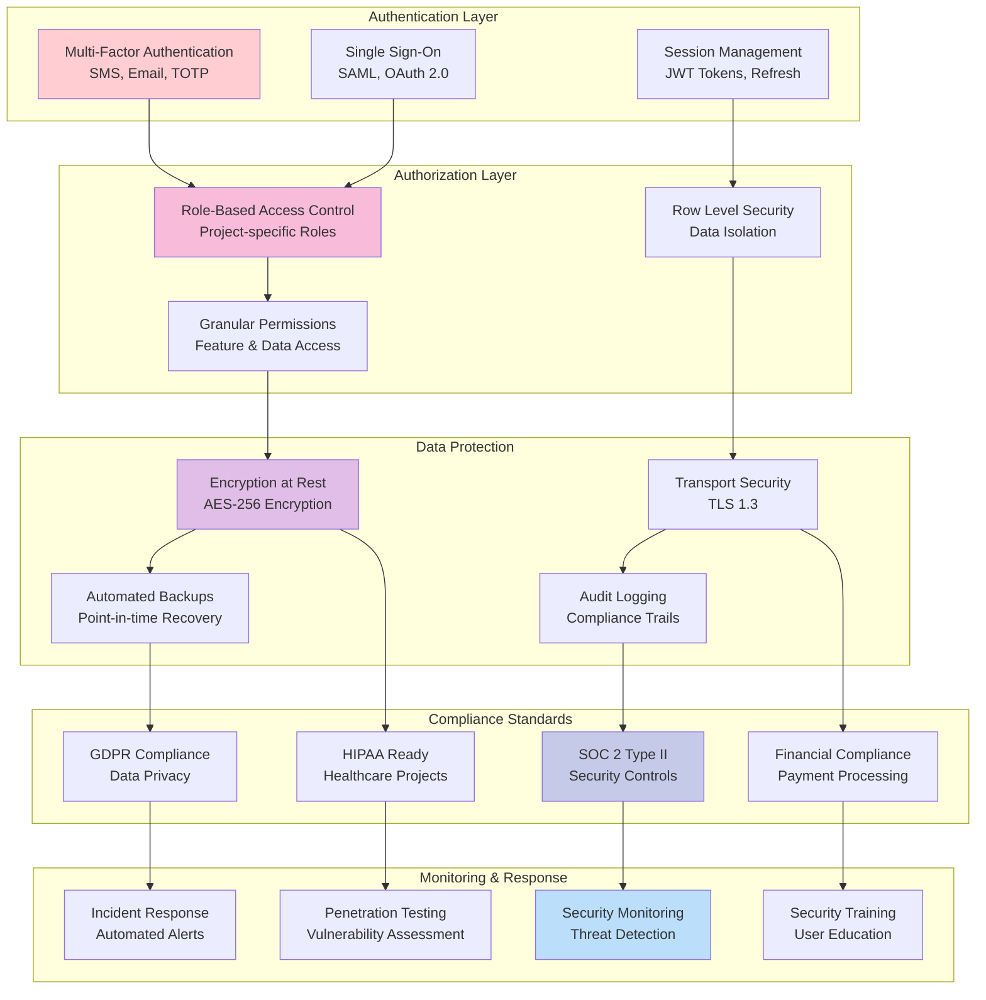

# CapitalSure Universal Construction OS - Project Understanding Diagrams

## 1. System Architecture Overview

## 2. User Personas & Journeys

## 3. Core Data Relationships

## 4. Feature Ecosystem Map

## 5. User Experience Flow

## 6. Implementation Phases

## 7. Technology Stack Deep Dive

## 8. Security & Compliance Framework

## Key Business Value Propositions

### For Owners/Developers

- **Real-time Project Visibility**: Live dashboards showing budget burn rate, schedule progress, and milestone achievement
- **Financial Control**: Automated progress billing, cost tracking, and cash flow management
- **Risk Mitigation**: Early warning systems for schedule delays and cost overruns
- **Compliance Assurance**: Automated compliance tracking and audit trails

### For General Contractors

- **Unified Project Management**: Single platform for scheduling, communication, and document management
- **Resource Optimization**: AI-powered resource allocation and schedule optimization
- **Subcontractor Coordination**: Streamlined subcontractor management and payment processing
- **Mobile-First Field Operations**: Full functionality on mobile devices for field workers

### For Subcontractors

- **Simplified Workflow**: Easy task management, progress reporting, and payment tracking
- **Clear Communication**: Real-time messaging and document sharing with project teams
- **Fair Payment Processing**: Transparent milestone-based payments with automated processing
- **Skills Showcase**: Profile management and performance tracking for future opportunities

### For Lenders/Sureties

- **Transparent Monitoring**: Real-time access to project progress and financial performance
- **Risk Assessment**: Comprehensive data for informed lending and bonding decisions
- **Compliance Verification**: Automated compliance reporting and audit trails
- **Milestone Verification**: Photo documentation and progress verification for draw requests

---

_This comprehensive overview demonstrates our deep understanding of the CapitalSure Universal Construction OS, highlighting both the technical architecture and the business value it delivers to all construction industry stakeholders._
