# CapitalSure - System Architecture & UX Flow Documentation

## Overview

This document provides comprehensive mermaid diagrams that illustrate our understanding of the CapitalSure Universal Construction Operating System based on the complete documentation analysis.

---

## 1. System Architecture Overview

---

## 2. Database Schema Relationships

---

## 3. User Authentication & Authorization Flow

---

## 4. Mobile-First User Journey

---

## 5. Project Management Workflow

---

## 6. Payment & Escrow System Flow

---

## 7. Real-time Collaboration Features

```mermaid
graph LR
    subgraph "Field Workers"
        FW1[Worker 1<br/>📱 Mobile]
        FW2[Worker 2<br/>📱 Mobile]
        FW3[Worker 3<br/>📱 Mobile]
    end

    subgraph "Project Managers"
        PM1[PM 1<br/>💻 Desktop]
        PM2[PM 2<br/>📱 Tablet]
    end

    subgraph "Clients"
        C1[Client<br/>🖥️ Web Dashboard]
    end

    subgraph "Real-time Engine"
        RT[Supabase<br/>Real-time]
        DB[(Database)]
    end

    FW1 -->|Progress Updates| RT
    FW2 -->|Photo Upload| RT
    FW3 -->|Time Tracking| RT

    RT -->|Live Updates| PM1
    RT -->|Notifications| PM2
    RT -->|Dashboard Sync| C1

    RT <--> DB

    PM1 -->|Task Assignment| RT
    PM2 -->|Schedule Changes| RT
    C1 -->|Milestone Approval| RT

    RT -->|Push Notifications| FW1
    RT -->|Push Notifications| FW2
    RT -->|Push Notifications| FW3

    style RT fill:#ff9800
    style DB fill:#4caf50
```

---

## 8. Offline-First Architecture

---

## 9. Security & Compliance Framework

---

## 10. Performance Optimization Strategy

---

## Key Implementation Insights

### 🎯 **Core Value Propositions**

1. **Accountability**: Immutable progress tracking with photo documentation
2. **Schedule Certainty**: AI-powered scheduling with real-time adjustments
3. **Capital Protection**: Escrow-backed milestone payments

### 📱 **Mobile-First Design Principles**

1. **Touch-Optimized**: 44px+ touch targets for work glove compatibility
2. **Offline-Capable**: Full functionality without internet connection
3. **Voice-Enabled**: Hands-free operation for safety compliance
4. **Photo-Centric**: Optimized image handling and compression

### 🔒 **Security & Compliance**

1. **Multi-layered Security**: RLS, authentication, and encryption
2. **Industry Compliance**: Construction and financial regulations
3. **Audit Trails**: Complete change tracking and monitoring
4. **Privacy Controls**: GDPR/CCPA compliant data management

### 🚀 **Performance Standards**

1. **Core Web Vitals**: Optimized for mobile network conditions
2. **Progressive Enhancement**: Works on all devices and connections
3. **Real-time Sync**: Instant updates across all team members
4. **Scalable Architecture**: Handles enterprise-level projects

This architecture provides a comprehensive foundation for building the CapitalSure Universal Construction Operating System with all the features outlined in the documentation.
