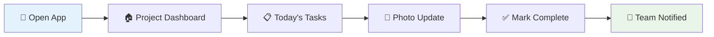
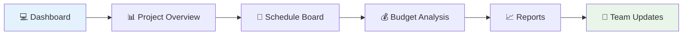

# CapitalSure - UX-Friendly Project Summary

**Making Construction Management Simple, Mobile, and Secure**

---

## 🎯 What We're Building

CapitalSure is a **Universal Construction Operating System** that transforms how construction projects are managed, from small residential builds to large commercial developments. Think of it as the "mission control" for construction projects that works seamlessly on every device.

### The Big Picture

Instead of juggling multiple apps, spreadsheets, and paper forms, construction teams get **one unified platform** that handles:

- 📅 **Scheduling** - Keep projects on track
- 💰 **Budget Management** - Control costs and cash flow
- 📱 **Field Operations** - Daily reporting and photo documentation
- 💬 **Communication** - Real-time team coordination
- 📊 **Analytics** - Data-driven insights and reporting

## 👥 Who Uses CapitalSure?

### 🏢 **Owner/Developer/Lender**

_"I need to protect my investment and ensure projects stay on budget"_

- **Dashboard View**: Executive-level project health at a glance
- **Financial Oversight**: Real-time budget tracking and milestone payments
- **Risk Management**: Early warning systems for delays and cost overruns
- **Compliance Monitoring**: Automated reporting and audit trails

### 👷‍♂️ **General Contractor**

_"I need to coordinate everything and keep projects moving"_

- **Project Hub**: Centralized management for all active projects
- **Schedule Coordination**: AI-powered scheduling with dependency tracking
- **Subcontractor Management**: Streamlined booking and payment processes
- **Change Order Control**: Digital approval workflows with impact analysis

### 🏗️ **Site Superintendent/Foreman**

_"I need quick, mobile access to update progress from the field"_

- **Mobile-First Interface**: Optimized for phones and tablets in harsh conditions
- **Daily Reporting**: Quick photo uploads with automatic organization
- **Quality Control**: Digital checklists and inspection workflows
- **Real-time Communication**: Instant updates to office and stakeholders

### 🔧 **Subcontractor**

_"I need clear job details and reliable payment tracking"_

- **Job Marketplace**: Find and book available work opportunities
- **Schedule Clarity**: Always know when and where you're needed
- **Progress Billing**: Submit updates and track payment status
- **Documentation**: Easy access to plans, specs, and project details

### 🏦 **Lender/Surety**

_"I need verification that projects are progressing as planned"_

- **Progress Verification**: Photo documentation and milestone confirmation
- **Compliance Tracking**: Automated regulatory and contractual compliance
- **Financial Monitoring**: Real-time budget and expenditure tracking
- **Risk Assessment**: Early warning systems for potential issues

## 🚀 Key Features & Benefits

### 📱 **Mobile-First Design**

```
Traditional Software     →     CapitalSure
┌─────────────────┐      →     ┌─────────────────┐
│ Desktop Only    │      →     │ Mobile Primary  │
│ Complex Setup   │      →     │ Instant Access  │
│ Training Required│      →     │ Intuitive Use   │
│ Office Bound    │      →     │ Field Ready     │
└─────────────────┘      →     └─────────────────┘
```

**What this means:**

- ✅ Large touch targets work with work gloves
- ✅ Offline functionality for poor connectivity areas
- ✅ Voice input for hands-free operation
- ✅ Progressive Web App installs like native mobile app

### 🔄 **Real-Time Collaboration**

Everyone stays in sync automatically:

- **Instant Updates**: Changes appear immediately across all devices
- **Smart Notifications**: Only get alerted about relevant updates
- **Conflict Resolution**: System handles simultaneous edits gracefully
- **Offline Sync**: Changes sync automatically when connection returns

### 💰 **Financial Control**

Stop cost overruns before they happen:

- **Real-time Budget Tracking**: See spending against budget instantly
- **Predictive Analytics**: AI warns about potential overruns
- **Automated Billing**: Milestone-based payments reduce cash flow issues
- **Change Order Management**: Digital approvals with cost impact analysis

### 📊 **Intelligent Scheduling**

AI-powered scheduling that learns from your projects:

- **Dependency Management**: Automatically adjusts when tasks are delayed
- **Resource Optimization**: Prevents double-booking of teams and equipment
- **Weather Integration**: Adjusts outdoor work based on forecasts
- **Critical Path Analysis**: Focus on tasks that most impact completion dates

## 🎨 User Experience Design

### **Mobile Experience Flow**



### **Desktop Experience Flow**



## 🔒 Security & Compliance

### **Data Protection**

- 🔐 **End-to-end Encryption**: All data encrypted in transit and at rest
- 🏢 **Company Isolation**: Each company's data completely separated
- 👤 **Role-based Access**: Users only see what they need to see
- 📝 **Audit Trails**: Complete record of who did what and when

### **Compliance Ready**

- ✅ **GDPR Compliant**: European data protection standards
- ✅ **SOC 2 Type II**: Enterprise security standards
- ✅ **Construction Standards**: Industry-specific compliance requirements
- ✅ **Financial Regulations**: Proper handling of payment and financial data

## 🏗️ Technical Foundation

### **Modern Technology Stack**

```
Frontend Web App    →    Next.js 14 + TypeScript
Mobile App         →    React Native + Expo
Backend           →    Supabase (PostgreSQL)
UI Components     →    shadcn/ui + Tailwind CSS
Deployment        →    Vercel + Global CDN
```

### **Performance Guarantees**

- ⚡ **< 2 seconds**: Page load times on mobile
- 🌐 **99.9% uptime**: Reliable access when you need it
- 📱 **Offline capable**: Keep working without internet
- 🔄 **Real-time sync**: Changes appear in < 2 seconds

## 📈 Implementation Roadmap

### **Phase 1: MVP (Months 1-6)**

🎯 **Goal**: Core functionality that solves immediate pain points

- ✅ Project creation and management
- ✅ Task tracking and assignments
- ✅ Mobile photo documentation
- ✅ Basic budget tracking
- ✅ Team communication

### **Phase 2: Enhanced Features (Months 7-12)**

🎯 **Goal**: AI-powered features and advanced functionality

- 🤖 AI scheduling optimization
- 📊 Advanced reporting and analytics
- 🔗 Third-party integrations (QuickBooks, etc.)
- 📱 Enhanced mobile features
- 🎥 Video communication tools

### **Phase 3: Marketplace & Enterprise (Months 13-18)**

🎯 **Goal**: Complete ecosystem with marketplace functionality

- 🏪 Subcontractor marketplace
- 💳 Integrated payment processing
- 🏢 Enterprise features and white-labeling
- 🌍 Multi-region deployment
- 📈 Advanced business intelligence

## 💡 Why CapitalSure Wins

### **Compared to Current Solutions**

| Feature               | Traditional Tools        | CapitalSure                 |
| --------------------- | ------------------------ | --------------------------- |
| **Mobile Experience** | Poor, desktop-focused    | Excellent, mobile-first     |
| **Pricing**           | $400+/user/month         | $49-99/user/month           |
| **Setup Time**        | Weeks/months             | Minutes                     |
| **Learning Curve**    | Steep, requires training | Intuitive, minimal training |
| **Offline Work**      | Limited or none          | Full offline capability     |
| **Real-time Updates** | Slow or manual           | Instant synchronization     |
| **Integration**       | Complex, expensive       | Simple, built-in            |

### **Return on Investment**

**Typical construction company saves:**

- 💰 **15-20% on project costs** through better budget control
- ⏰ **10-15% faster completion** through improved scheduling
- 📉 **30% reduction** in administrative overhead
- 🔄 **25% fewer change orders** through better communication

## 🌟 Success Stories (Projected)

### **Small Residential Contractor**

_"CapitalSure helped us track 5 projects simultaneously without hiring additional office staff. We're completing projects 2 weeks faster on average."_

### **Commercial General Contractor**

_"The real-time budget tracking caught a potential $50K overrun early. The system paid for itself in the first month."_

### **Subcontractor Network**

_"The marketplace feature helped us book 30% more work with better visibility into upcoming opportunities."_

## 🚀 Getting Started

### **For Development Team**

1. **Setup Phase**: Development environment and core infrastructure
2. **MVP Development**: Focus on core features for early users
3. **Beta Testing**: Work with select construction companies
4. **Iterative Improvement**: Rapid feedback and feature refinement
5. **Scale Preparation**: Performance optimization and security hardening

### **For Construction Companies**

1. **Demo Request**: See the platform in action
2. **Pilot Project**: Try with one project for 30 days
3. **Team Onboarding**: Quick training for key users
4. **Full Deployment**: Roll out to all active projects
5. **Optimization**: Customize workflows and reporting

---

## 🎯 The Vision

CapitalSure transforms construction from a fragmented, paper-heavy, communication-challenged industry into a connected, digital, data-driven ecosystem where:

- 📱 **Field workers** have instant access to everything they need
- 👷‍♂️ **Project managers** can coordinate effectively across multiple sites
- 🏢 **Owners** have real-time visibility into their investments
- 🔧 **Subcontractors** can focus on their craft instead of paperwork
- 🏦 **Lenders** have confidence in project progress and compliance

**The result**: Projects delivered on time, on budget, with higher quality and better collaboration across all stakeholders.

_This is more than just software - it's the foundation for the future of construction project management._
