# CapitalSure - Project Understanding & System Design

**Universal Construction Operating System - Visual Architecture & User Experience Design**

---

## 1. System Architecture Overview

## 2. User Personas & Primary Workflows

```mermaid
graph TD
    subgraph "Construction Stakeholders"
        OWNER[👨‍💼 Owner/Developer/Lender<br/>Financial Oversight<br/>Risk Mitigation]
        GC[👷‍♂️ General Contractor<br/>Project Management<br/>Coordination]
        SUPER[🏗️ Site Superintendent<br/>Daily Operations<br/>Field Management]
        SUB[🔧 Subcontractor<br/>Specialized Work<br/>Payment Tracking]
        LENDER[🏦 Lender/Surety<br/>Compliance<br/>Verification]
    end

    subgraph "Core Workflows"
        OWNER --> DASHBOARD1[Executive Dashboard<br/>Project Health<br/>Financial Reports]
        OWNER --> MILESTONE[Milestone Approval<br/>Payment Release<br/>Risk Assessment]

        GC --> SCHEDULE[Schedule Management<br/>Resource Planning<br/>Coordination]
        GC --> BUDGET[Budget Control<br/>Change Orders<br/>Cost Tracking]

        SUPER --> DAILY[Daily Reporting<br/>Progress Photos<br/>Issue Tracking]
        SUPER --> QUALITY[Quality Control<br/>Safety Inspections<br/>Compliance]

        SUB --> BOOKING[Job Booking<br/>Schedule Coordination<br/>Resource Planning]
        SUB --> INVOICE[Progress Billing<br/>Payment Status<br/>Documentation]

        LENDER --> VERIFY[Progress Verification<br/>Compliance Check<br/>Risk Monitoring]
        LENDER --> AUDIT[Audit Reports<br/>Financial Review<br/>Milestone Validation]
    end

    classDef persona fill:#e3f2fd
    classDef workflow fill:#fff3e0

    class OWNER,GC,SUPER,SUB,LENDER persona
    class DASHBOARD1,MILESTONE,SCHEDULE,BUDGET,DAILY,QUALITY,BOOKING,INVOICE,VERIFY,AUDIT workflow
```

## 3. Database Schema & Core Relationships

## 4. Feature Hierarchy & Navigation Structure

## 5. Technology Stack & Implementation Layers

## 6. Mobile-First Responsive Design Flow

```mermaid
graph TD
    subgraph "Device Breakpoints"
        MOBILE[📱 Mobile<br/>320px - 767px<br/>Primary Interface]
        TABLET[📱 Tablet<br/>768px - 1023px<br/>Enhanced Features]
        DESKTOP[💻 Desktop<br/>1024px - 1439px<br/>Full Dashboard]
        LARGE[🖥️ Large Screen<br/>1440px+<br/>Multi-panel View]
    end

    subgraph "Mobile Optimizations"
        TOUCH[Large Touch Targets<br/>44px minimum<br/>Glove-friendly]
        OFFLINE[Offline Capability<br/>Local Storage<br/>Sync on Connect]
        GESTURES[Gesture Support<br/>Swipe Navigation<br/>Voice Input]
        BATTERY[Battery Optimization<br/>Efficient Caching<br/>Background Sync]
    end

    subgraph "Progressive Enhancement"
        CORE[Core Functionality<br/>Task Management<br/>Communication]
        ENHANCED[Enhanced Features<br/>Advanced Analytics<br/>Detailed Reports]
        DESKTOP_ONLY[Desktop Features<br/>Multi-window<br/>Keyboard Shortcuts]
    end

    subgraph "Content Strategy"
        PRIORITY[Content Prioritization<br/>Essential First<br/>Progressive Disclosure]
        LAYOUT[Adaptive Layout<br/>Single Column → Grid<br/>Contextual Navigation]
        MEDIA[Responsive Media<br/>Optimized Images<br/>Conditional Loading]
    end

    MOBILE --> TOUCH
    MOBILE --> OFFLINE
    MOBILE --> GESTURES
    MOBILE --> BATTERY

    MOBILE --> CORE
    TABLET --> ENHANCED
    DESKTOP --> DESKTOP_ONLY
    LARGE --> DESKTOP_ONLY

    CORE --> PRIORITY
    ENHANCED --> LAYOUT
    DESKTOP_ONLY --> MEDIA

    classDef device fill:#e3f2fd
    classDef optimization fill:#e8f5e8
    classDef enhancement fill:#fff3e0
    classDef strategy fill:#f3e5f5

    class MOBILE,TABLET,DESKTOP,LARGE device
    class TOUCH,OFFLINE,GESTURES,BATTERY optimization
    class CORE,ENHANCED,DESKTOP_ONLY enhancement
    class PRIORITY,LAYOUT,MEDIA strategy
```

## 7. Real-time Collaboration & Synchronization

```mermaid
sequenceDiagram
    participant Mobile as 📱 Field Worker
    participant Web as 💻 Project Manager
    participant Server as 🏢 Supabase
    participant Push as 🔔 Push Notifications

    Note over Mobile,Push: Real-time Project Updates

    Mobile->>Server: Update task progress
    Server->>Server: Validate & store update
    Server->>Web: Real-time sync via WebSocket
    Server->>Push: Trigger notifications
    Push->>Web: Show progress notification

    Note over Mobile,Push: Offline Scenario

    Mobile->>Mobile: Store update locally (offline)
    Mobile-->>Server: Connection lost
    Mobile->>Mobile: Queue pending actions

    Note over Mobile,Push: Reconnection & Sync

    Mobile->>Server: Reconnect & sync queued actions
    Server->>Server: Process queued updates
    Server->>Web: Sync latest changes
    Web->>Web: Update UI with latest data

    Note over Mobile,Push: Conflict Resolution

    Mobile->>Server: Update task status
    Web->>Server: Simultaneous update (conflict)
    Server->>Server: Detect conflict
    Server->>Mobile: Request conflict resolution
    Server->>Web: Request conflict resolution
    Mobile->>Server: Resolve with user input
    Server->>Web: Apply resolved changes
```

## 8. Security & Permission Model

---

## Key Design Principles

### 🎯 User-Centered Design

- **Mobile-first**: Field workers are the primary users
- **Touch-friendly**: Large targets for gloved hands
- **Offline-capable**: Work continues without connectivity
- **Voice-enabled**: Hands-free operation when needed

### 🏗️ Construction-Specific

- **Hierarchical data**: Projects → Tasks → Subtasks
- **Real-time collaboration**: Multiple stakeholders, instant updates
- **Document-heavy**: Plans, photos, contracts, reports
- **Compliance-focused**: Audit trails, permissions, security

### ⚡ Performance-First

- **Progressive loading**: Critical content first
- **Efficient caching**: Reduce data usage and improve speed
- **Image optimization**: Automatic compression and formats
- **Background sync**: Non-blocking updates

### 🔒 Security-First

- **Row-level security**: Company and project isolation
- **Comprehensive auditing**: Track all actions and changes
- **Encrypted storage**: Protect sensitive project data
- **Role-based access**: Granular permission control

This design ensures CapitalSure delivers a world-class construction management experience that works seamlessly across all devices and environments while maintaining the security and reliability required for professional construction projects.
