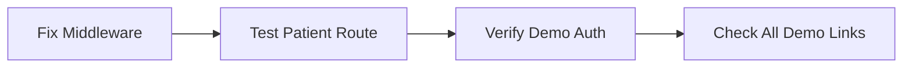
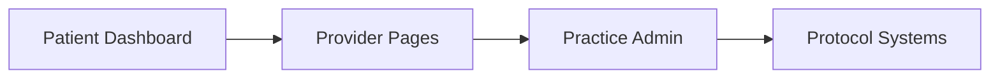

# TJV Recovery Platform Demo Restoration Plan

## Current Demo Assets Analysis

### ✅ **Working Demo Components:**
1. **Demo Navigation Hub** (`/demo-navigation/`) - Complete navigation system
2. **Demo Auth System** - Mock authentication with 4 provider roles
3. **Rich Mock Data** - 6 patients, providers, alerts, analytics
4. **Patient Chat Interface** (`/demo/patient-chat/`) - Fully functional with timeline
5. **Provider Dashboard** (`/demo/provider/dashboard/`) - Complete with metrics
6. **Practice Management** - Admin settings, staff management
7. **Protocol Builder** - Working demo system

### 🔧 **Key Issues to Fix:**

## **Priority 1: Middleware Patient Route Fix**
**Issue:** `/patient` redirects to `/preop` due to surgery date logic in middleware
**Solution:** Create demo mode bypass in middleware for patient routes

## **Priority 2: Demo Navigation Routing**
**Issue:** Some demo links may point to non-demo pages
**Solution:** Ensure all demo navigation uses correct demo paths

## **Priority 3: Missing Patient Portal Pages**
**Issue:** Need main patient dashboard/portal (not just chat)
**Solution:** Create patient dashboard matching the provider interface

## Detailed Restoration Plan

### **Phase 1: Core Infrastructure (Immediate)**

1. **Middleware Fix** - Bypass patient redirection in demo mode
2. **Route Testing** - Ensure `/patient` shows main portal in demo
3. **Demo Auth Verification** - Confirm mock authentication works
4. **Link Auditing** - Verify all demo navigation links work

### **Phase 2: Page Restoration (Next)**

1. **Patient Dashboard Creation** - Main patient portal interface
2. **Provider Page Fixes** - Ensure all provider demo pages work
3. **Practice Admin Restoration** - Complete admin functionality
4. **Protocol Builder Testing** - Verify protocol creation works

### **Phase 3: Data Integration (Final)**

1. **Mock Data Validation** - Test all data operations
2. **End-to-End Testing** - Complete user journeys
3. **Documentation Update** - Update demo guides
4. **Final Demo Verification** - Complete system test

## **Demo Capabilities to Restore**

### **Patient Experience:**
- ✅ Patient Chat with Recovery Assistant
- 🔧 Patient Dashboard (needs creation)
- ✅ Pre-op Journey
- ✅ Post-op Recovery

### **Provider Experience:**
- ✅ Provider Dashboard with Analytics
- ✅ Patient Management System
- ✅ Chat Monitoring
- ✅ Content Management (Exercises, Videos, Forms)
- ✅ Protocol Management
- ✅ Message Center

### **Practice Administration:**
- ✅ Practice Dashboard
- ✅ Staff Management
- ✅ Admin Settings
- ✅ Patient Registry

### **Protocol Management:**
- ✅ Protocol Builder
- ✅ Protocol Templates
- ✅ Recovery Timeline Preview

## **Implementation Priority**

1. **CRITICAL:** Fix middleware patient route redirection
2. **HIGH:** Create patient dashboard/portal
3. **MEDIUM:** Audit and fix demo navigation links
4. **LOW:** Enhance mock data with more comprehensive protocols

## **Current State Assessment**

The demo system appears to be **90% complete**! The main issue is the middleware redirect preventing access to the patient portal. The extensive mock data, auth system, and most demo pages are already built and functional.

**Key Finding:** Yesterday's work at 9pm created a comprehensive demo system with:
- 333 lines of navigation code
- 503 lines of realistic healthcare data
- Complete provider dashboard with analytics
- Patient chat interface matching design screenshots
- Practice management interfaces
- Protocol builder functionality

**Next Action:** Fix the middleware routing issue to unlock full demo functionality.