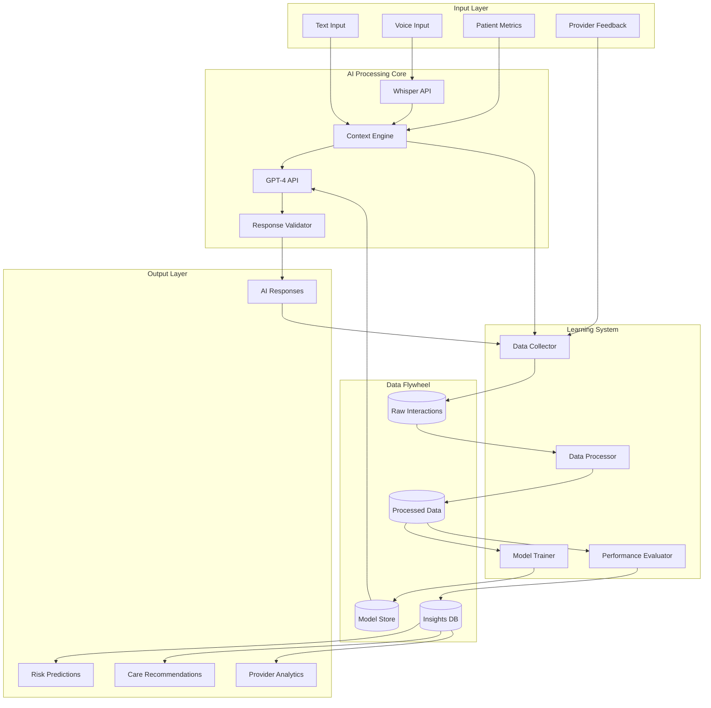
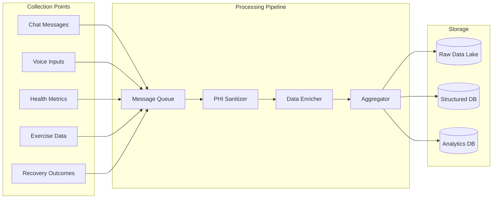
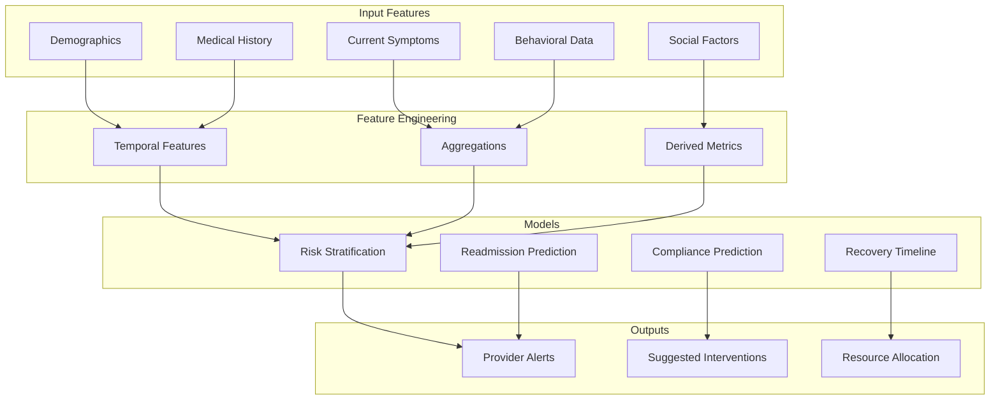
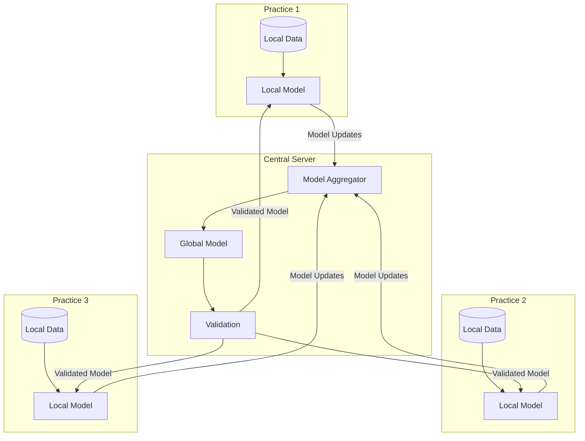
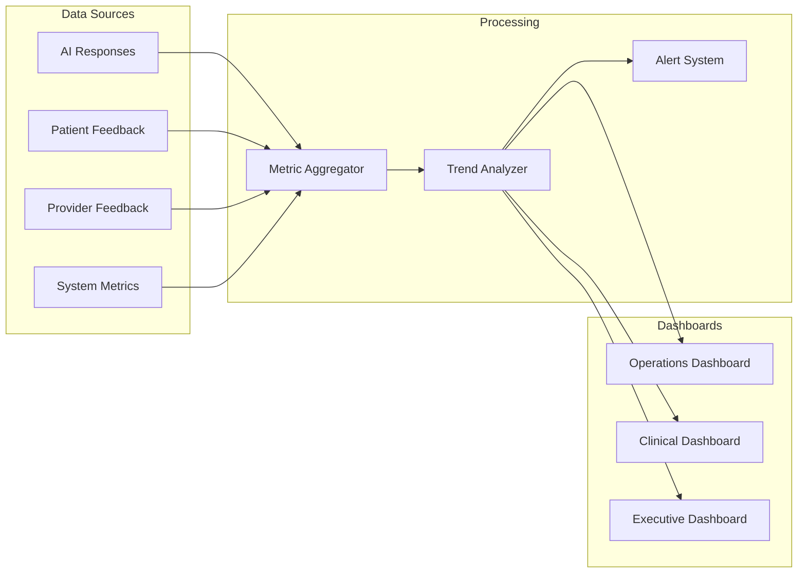

# AI Recovery Agent & Data Flywheel Architecture

## Overview

The AI Recovery Agent is the intelligent core of the TJV Recovery Platform, leveraging OpenAI's GPT-4 for conversational AI and Whisper for voice processing. The Data Flywheel concept ensures that every patient interaction makes the system smarter, creating a continuous improvement cycle that enhances recovery outcomes over time.

## Core Concepts

### 1. Data Flywheel Principle

Every interaction contributes to system improvement:
- Patient conversations → Training data
- Recovery outcomes → Model refinement
- Provider feedback → Accuracy enhancement
- Aggregate patterns → Predictive insights

### 2. AI Recovery Agent Components

- **Conversational AI**: GPT-4 powered responses
- **Voice Processing**: Whisper API integration
- **Context Engine**: Patient history and state management
- **Learning Pipeline**: Continuous model improvement
- **Analytics Engine**: Pattern recognition and predictions

## System Architecture



## AI Recovery Agent Details

### 1. OpenAI GPT-4 Integration

```typescript
interface AIAgentConfig {
  model: 'gpt-4-turbo-preview'
  temperature: 0.7
  maxTokens: 2000
  systemPrompt: string
  contextWindow: 8000
}

class AIRecoveryAgent {
  private openai: OpenAI
  private contextEngine: ContextEngine
  private validator: ResponseValidator
  
  async generateResponse(
    input: PatientInput,
    context: PatientContext
  ): Promise<AIResponse> {
    // Build comprehensive prompt
    const prompt = await this.buildPrompt(input, context)
    
    // Generate AI response
    const completion = await this.openai.chat.completions.create({
      model: 'gpt-4-turbo-preview',
      messages: prompt,
      temperature: 0.7,
      stream: true,
      functions: this.getAvailableFunctions()
    })
    
    // Validate medical safety
    const validated = await this.validator.validate(completion)
    
    // Store for flywheel
    await this.storeInteraction(input, validated, context)
    
    return validated
  }
}
```

### 2. Whisper Voice Processing

```typescript
class VoiceProcessor {
  private whisper: WhisperAPI
  private audioProcessor: AudioProcessor
  
  async processVoiceInput(
    audioData: ArrayBuffer,
    metadata: AudioMetadata
  ): Promise<TranscriptionResult> {
    // Pre-process audio
    const processed = await this.audioProcessor.prepare(audioData, {
      sampleRate: 16000,
      channels: 1,
      format: 'wav'
    })
    
    // Transcribe with Whisper
    const transcription = await this.whisper.transcribe({
      audio: processed,
      language: metadata.language || 'en',
      prompt: this.getMedicalContextPrompt(),
      temperature: 0.2 // Lower temperature for accuracy
    })
    
    // Extract medical entities
    const entities = await this.extractMedicalEntities(transcription.text)
    
    return {
      text: transcription.text,
      confidence: transcription.confidence,
      entities,
      timestamp: new Date()
    }
  }
}
```

### 3. Context Engine

```typescript
interface PatientContext {
  // Medical History
  medicalHistory: {
    surgeryType: string
    surgeryDate: Date
    complications: string[]
    allergies: string[]
    medications: Medication[]
  }
  
  // Current State
  currentState: {
    painLevel: number
    symptoms: Symptom[]
    vitalSigns: VitalSigns
    mobilityScore: number
    lastCheckIn: Date
  }
  
  // Recovery Progress
  recoveryProgress: {
    milestones: Milestone[]
    exerciseCompliance: number
    medicationAdherence: number
    overallProgress: number
  }
  
  // Conversation History
  conversationHistory: {
    recentMessages: Message[]
    topics: string[]
    sentiment: number
    concerns: string[]
  }
}

class ContextEngine {
  async buildContext(patientId: string): Promise<PatientContext> {
    // Fetch from multiple sources
    const [medical, state, progress, conversation] = await Promise.all([
      this.fetchMedicalHistory(patientId),
      this.fetchCurrentState(patientId),
      this.fetchRecoveryProgress(patientId),
      this.fetchConversationHistory(patientId)
    ])
    
    // Synthesize context
    return this.synthesizeContext({
      medical,
      state,
      progress,
      conversation
    })
  }
}
```

## Data Flywheel Implementation

### 1. Data Collection Pipeline



### 2. Learning Pipeline

```typescript
class LearningPipeline {
  private dataProcessor: DataProcessor
  private modelTrainer: ModelTrainer
  private evaluator: ModelEvaluator
  
  async processLearningCycle(): Promise<void> {
    // 1. Collect recent interactions
    const interactions = await this.collectInteractions({
      timeframe: '24h',
      minQuality: 0.8
    })
    
    // 2. Process and label data
    const trainingData = await this.dataProcessor.process(interactions, {
      sanitizePHI: true,
      extractFeatures: true,
      labelOutcomes: true
    })
    
    // 3. Update model
    const updatedModel = await this.modelTrainer.train({
      baseModel: 'current-production',
      newData: trainingData,
      validationSplit: 0.2
    })
    
    // 4. Evaluate performance
    const evaluation = await this.evaluator.evaluate(updatedModel, {
      metrics: ['accuracy', 'f1', 'medical_safety'],
      threshold: 0.95
    })
    
    // 5. Deploy if improved
    if (evaluation.improved) {
      await this.deployModel(updatedModel)
    }
  }
}
```

### 3. Feedback Loop Integration

```typescript
interface FeedbackLoop {
  // Provider feedback on AI responses
  providerFeedback: {
    responseId: string
    accuracy: number
    safety: number
    relevance: number
    corrections?: string
  }
  
  // Patient outcome correlation
  outcomeCorrelation: {
    conversationId: string
    recoveryMetrics: RecoveryMetrics
    timeToRecovery: number
    complications: boolean
  }
  
  // System performance metrics
  systemMetrics: {
    responseTime: number
    userSatisfaction: number
    escalationRate: number
    errorRate: number
  }
}

class FeedbackIntegrator {
  async integrateFeedback(feedback: FeedbackLoop): Promise<void> {
    // Update response quality scores
    await this.updateQualityScores(feedback.providerFeedback)
    
    // Correlate with outcomes
    await this.correlateOutcomes(feedback.outcomeCorrelation)
    
    // Adjust system parameters
    await this.optimizeSystem(feedback.systemMetrics)
    
    // Trigger retraining if needed
    if (this.shouldRetrain(feedback)) {
      await this.triggerRetraining()
    }
  }
}
```

## Predictive Analytics Architecture

### 1. Risk Prediction Models



### 2. Predictive Models Implementation

```typescript
class PredictiveAnalytics {
  private riskModel: MLModel
  private readmissionModel: MLModel
  private complianceModel: MLModel
  
  async predictPatientRisk(
    patientId: string
  ): Promise<RiskAssessment> {
    // Gather comprehensive features
    const features = await this.gatherFeatures(patientId)
    
    // Run ensemble predictions
    const [risk, readmission, compliance] = await Promise.all([
      this.riskModel.predict(features),
      this.readmissionModel.predict(features),
      this.complianceModel.predict(features)
    ])
    
    // Combine predictions with confidence intervals
    return {
      overallRisk: this.calculateOverallRisk(risk, readmission, compliance),
      riskFactors: this.identifyRiskFactors(features, risk),
      recommendations: this.generateRecommendations(risk, compliance),
      confidence: this.calculateConfidence(risk, readmission, compliance),
      nextAssessment: this.scheduleNextAssessment(risk.score)
    }
  }
  
  private calculateOverallRisk(
    risk: Prediction,
    readmission: Prediction,
    compliance: Prediction
  ): RiskScore {
    // Weighted combination of predictions
    const weights = {
      generalRisk: 0.4,
      readmissionRisk: 0.35,
      nonComplianceRisk: 0.25
    }
    
    return {
      score: (
        risk.probability * weights.generalRisk +
        readmission.probability * weights.readmissionRisk +
        (1 - compliance.probability) * weights.nonComplianceRisk
      ),
      category: this.categorizeRisk(risk, readmission, compliance),
      trend: this.calculateTrend(risk.history)
    }
  }
}
```

### 3. Real-time Learning Updates

```typescript
class RealtimeLearning {
  private streamProcessor: StreamProcessor
  private onlineModel: OnlineMLModel
  
  async processRealtimeUpdate(
    event: PatientEvent
  ): Promise<void> {
    // Extract features from event
    const features = await this.extractEventFeatures(event)
    
    // Update online model
    await this.onlineModel.partialFit(features, event.outcome)
    
    // Check for concept drift
    if (await this.detectConceptDrift()) {
      await this.triggerModelRetraining()
    }
    
    // Update patient risk in real-time
    const updatedRisk = await this.onlineModel.predict(features)
    await this.updatePatientRisk(event.patientId, updatedRisk)
  }
}
```

## Data Privacy & Security

### 1. PHI Handling in AI Pipeline

```typescript
class PHISanitizer {
  async sanitizeForTraining(
    data: PatientData
  ): Promise<SanitizedData> {
    // Remove direct identifiers
    const deidentified = await this.removeIdentifiers(data)
    
    // Apply k-anonymity
    const anonymized = await this.applyKAnonymity(deidentified, k = 5)
    
    // Add differential privacy noise
    const private = await this.addDifferentialPrivacy(anonymized, epsilon = 1.0)
    
    // Generate synthetic data for sensitive fields
    const synthetic = await this.generateSynthetic(private)
    
    return synthetic
  }
}
```

### 2. Federated Learning Architecture



## Performance Optimization

### 1. Response Caching Strategy

```typescript
class AIResponseCache {
  private cache: RedisCache
  private embeddings: EmbeddingService
  
  async getCachedResponse(
    query: string,
    context: PatientContext
  ): Promise<CachedResponse | null> {
    // Generate query embedding
    const queryEmbedding = await this.embeddings.embed(query)
    
    // Find similar cached responses
    const similar = await this.cache.findSimilar(queryEmbedding, {
      threshold: 0.95,
      contextMatch: context.surgeryType
    })
    
    if (similar && this.isValid(similar, context)) {
      return {
        response: similar.response,
        confidence: similar.similarity,
        cached: true
      }
    }
    
    return null
  }
}
```

### 2. Model Optimization

```typescript
interface ModelOptimization {
  // Quantization for faster inference
  quantization: {
    precision: 'int8' | 'fp16'
    dynamicRange: boolean
  }
  
  // Pruning for smaller models
  pruning: {
    sparsity: number
    structuredPruning: boolean
  }
  
  // Distillation for efficient models
  distillation: {
    teacherModel: string
    studentModel: string
    temperature: number
  }
}
```

## Monitoring & Observability

### 1. AI Performance Metrics

```typescript
interface AIMetrics {
  // Response quality
  responseMetrics: {
    accuracy: number
    relevance: number
    safety: number
    latency: number
  }
  
  // Model performance
  modelMetrics: {
    inferenceTime: number
    tokenUsage: number
    errorRate: number
    driftScore: number
  }
  
  // Business impact
  businessMetrics: {
    patientSatisfaction: number
    providerAcceptance: number
    outcomeImprovement: number
    costPerInteraction: number
  }
}
```

### 2. Continuous Monitoring Dashboard



## Integration with Clinical Workflows

### 1. Provider Copilot Features

```typescript
class ProviderCopilot {
  async generateClinicalSummary(
    patientId: string,
    timeframe: string
  ): Promise<ClinicalSummary> {
    const data = await this.gatherPatientData(patientId, timeframe)
    
    const summary = await this.ai.generateSummary({
      template: 'clinical_summary',
      data,
      focus: ['recovery_progress', 'risk_factors', 'recommendations']
    })
    
    return {
      summary,
      keyMetrics: this.extractKeyMetrics(data),
      alerts: this.identifyAlerts(data),
      recommendations: this.generateRecommendations(data)
    }
  }
}
```

### 2. Automated Documentation

```typescript
class AutoDocumentation {
  async documentInteraction(
    interaction: PatientInteraction
  ): Promise<ClinicalNote> {
    const note = await this.ai.generateClinicalNote({
      interaction,
      template: 'SOAP',
      includeMetrics: true
    })
    
    return {
      subjective: note.subjective,
      objective: note.objective,
      assessment: note.assessment,
      plan: note.plan,
      metadata: {
        generatedAt: new Date(),
        confidence: note.confidence,
        requiresReview: note.confidence < 0.9
      }
    }
  }
}
```

## Future Enhancements

### 1. Multi-modal AI Integration
- Computer vision for wound assessment
- Gait analysis from video
- Emotion recognition
- Document understanding

### 2. Advanced Personalization
- Individual learning curves
- Cultural adaptation
- Personality-based communication
- Circadian rhythm optimization

### 3. Expanded Predictive Capabilities
- Long-term outcome prediction
- Complication prevention
- Resource optimization
- Population health insights