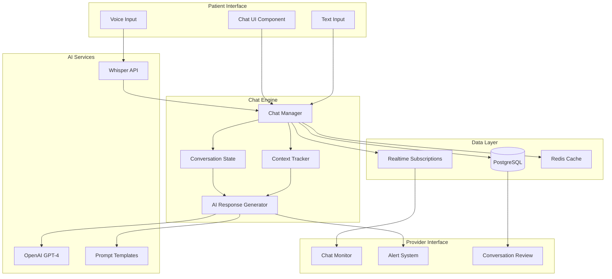
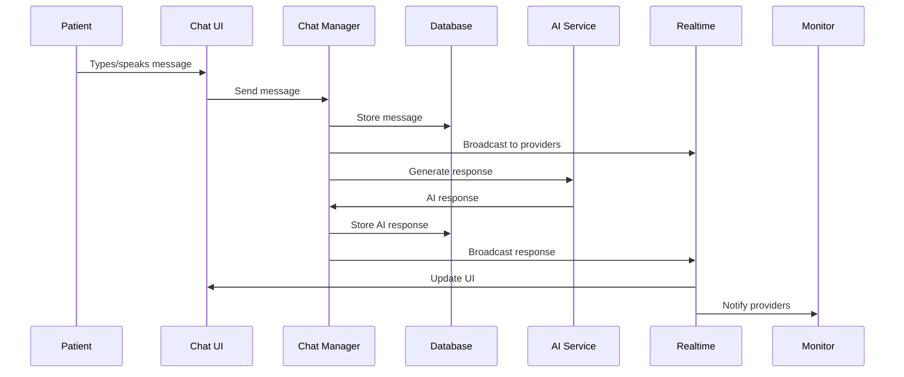
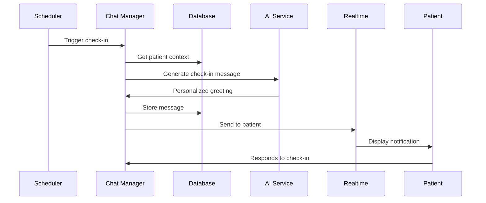

# Manus-style Chat System Architecture

## Overview

The Manus-style Chat System is the cornerstone of patient engagement in the TJV Recovery Platform. It provides a conversational AI interface that proactively engages patients throughout their recovery journey, mimicking the natural flow of healthcare provider conversations while leveraging AI for 24/7 availability.

## Key Features

### 1. Auto-Initiation System
- Proactive engagement based on patient milestones
- Time-based triggers for check-ins
- Event-driven conversations (e.g., post-surgery, medication reminders)
- Contextual awareness of patient state

### 2. Structured Check-ins
- Daily recovery assessments
- Pain level monitoring
- Medication adherence tracking
- Exercise completion verification
- Symptom reporting

### 3. Conversational AI
- Natural language processing via OpenAI GPT-4
- Context-aware responses
- Medical knowledge integration
- Escalation to human providers when needed

## Architecture Diagram



## Component Details

### 1. Chat UI Component (`components/chat/ChatInterface.tsx`)

The primary interface for patient interactions:

```typescript
interface ChatInterfaceProps {
  patientId: string
  providerId?: string
  sessionId: string
  mode: 'patient' | 'provider' | 'demo'
}
```

Key features:
- Real-time message updates
- Voice input support
- Typing indicators
- Message status tracking
- Auto-scrolling
- Responsive design

### 2. Chat Manager

Central orchestrator for all chat operations:

```typescript
class ChatManager {
  // Handles message routing
  async sendMessage(message: Message): Promise<void>
  
  // Manages conversation state
  async updateConversationState(state: ConversationState): Promise<void>
  
  // Triggers auto-initiated conversations
  async initiateCheckIn(type: CheckInType): Promise<void>
  
  // Processes AI responses
  async generateAIResponse(context: ConversationContext): Promise<string>
}
```

### 3. Conversation State Management

Maintains context across interactions:

```typescript
interface ConversationState {
  sessionId: string
  patientId: string
  currentTopic: string
  messageHistory: Message[]
  patientContext: {
    surgeryDate: Date
    currentMedications: Medication[]
    recentSymptoms: Symptom[]
    exerciseCompliance: number
  }
  aiContext: {
    lastCheckIn: Date
    escalationNeeded: boolean
    sentimentScore: number
  }
}
```

### 4. AI Response Generator

Integrates with OpenAI for intelligent responses:

```typescript
class AIResponseGenerator {
  private openai: OpenAI
  private promptTemplates: PromptTemplates
  
  async generateResponse(
    context: ConversationContext,
    messageHistory: Message[]
  ): Promise<AIResponse> {
    // Build contextual prompt
    const prompt = this.buildPrompt(context, messageHistory)
    
    // Get AI response
    const response = await this.openai.chat.completions.create({
      model: 'gpt-4-turbo-preview',
      messages: prompt,
      temperature: 0.7,
      stream: true
    })
    
    // Process and validate response
    return this.processResponse(response)
  }
}
```

## Message Flow

### 1. Patient-Initiated Message



### 2. Auto-Initiated Check-in



## Prompt Engineering

### 1. System Prompts

Base system prompt for medical context:

```typescript
const SYSTEM_PROMPT = `
You are a compassionate healthcare assistant supporting post-surgical recovery.
Your role is to:
- Monitor patient progress
- Provide encouragement and support
- Collect symptom information
- Remind about medications and exercises
- Escalate concerns to healthcare providers

Guidelines:
- Use empathetic, clear language
- Ask one question at a time
- Validate patient concerns
- Never provide medical diagnoses
- Always err on the side of caution
`
```

### 2. Context Injection

Dynamic context added to each conversation:

```typescript
function buildContextPrompt(patient: PatientContext): string {
  return `
Patient Information:
- Surgery: ${patient.surgeryType} on ${patient.surgeryDate}
- Current medications: ${patient.medications.join(', ')}
- Recent pain levels: ${patient.recentPainLevels}
- Exercise compliance: ${patient.exerciseCompliance}%
- Last check-in: ${patient.lastCheckIn}

Current Conversation Goal: ${patient.currentGoal}
  `
}
```

### 3. Check-in Templates

Structured templates for different check-in types:

```typescript
const CHECK_IN_TEMPLATES = {
  morning: {
    greeting: "Good morning! How are you feeling today?",
    followUps: [
      "How did you sleep last night?",
      "What's your pain level on a scale of 1-10?",
      "Have you taken your morning medications?"
    ]
  },
  evening: {
    greeting: "Hi there! How has your day been?",
    followUps: [
      "Did you complete your exercises today?",
      "Any new symptoms or concerns?",
      "How are your energy levels?"
    ]
  },
  medication: {
    greeting: "It's time for your {medicationName}",
    followUps: [
      "Have you taken your {medicationName}?",
      "Any side effects to report?"
    ]
  }
}
```

## Real-time Features

### 1. Message Synchronization

```typescript
// Supabase real-time subscription
const subscription = supabase
  .channel(`chat:${sessionId}`)
  .on('postgres_changes', {
    event: 'INSERT',
    schema: 'public',
    table: 'messages',
    filter: `session_id=eq.${sessionId}`
  }, (payload) => {
    handleNewMessage(payload.new)
  })
  .subscribe()
```

### 2. Typing Indicators

```typescript
// Broadcast typing status
const broadcastTyping = (isTyping: boolean) => {
  supabase.channel(`presence:${sessionId}`).send({
    type: 'broadcast',
    event: 'typing',
    payload: { userId, isTyping }
  })
}
```

### 3. Read Receipts

```typescript
// Mark messages as read
const markAsRead = async (messageIds: string[]) => {
  await supabase
    .from('message_receipts')
    .insert(
      messageIds.map(id => ({
        message_id: id,
        user_id: userId,
        read_at: new Date().toISOString()
      }))
    )
}
```

## Provider Monitoring

### 1. Chat Monitor Dashboard

Real-time view of active conversations:

```typescript
interface ChatMonitorView {
  activeConversations: Conversation[]
  alertedConversations: Conversation[]
  recentMessages: Message[]
  patientMetrics: {
    responseTime: number
    sentimentScore: number
    complianceRate: number
  }
}
```

### 2. Alert System

Automatic escalation for concerning patterns:

```typescript
const ALERT_TRIGGERS = {
  highPain: (level: number) => level >= 8,
  missedMedication: (count: number) => count >= 2,
  negativeSymptoms: (symptoms: string[]) => 
    symptoms.some(s => CONCERNING_SYMPTOMS.includes(s)),
  lowSentiment: (score: number) => score < 0.3,
  noResponse: (hours: number) => hours > 24
}
```

### 3. Conversation Analytics

```typescript
interface ConversationAnalytics {
  totalMessages: number
  aiMessages: number
  patientMessages: number
  averageResponseTime: number
  sentimentTrend: number[]
  topicDistribution: Record<string, number>
  escalationRate: number
}
```

## Security Considerations

### 1. Data Encryption
- All messages encrypted at rest
- TLS for data in transit
- End-to-end encryption for sensitive data

### 2. Access Control
- Row Level Security for message isolation
- Provider access limited to assigned patients
- Audit logs for all access

### 3. HIPAA Compliance
- PHI handling procedures
- Automatic data retention policies
- Consent management

## Performance Optimizations

### 1. Message Caching

```typescript
// Redis caching for recent messages
const getCachedMessages = async (sessionId: string) => {
  const cached = await redis.get(`messages:${sessionId}`)
  if (cached) return JSON.parse(cached)
  
  const messages = await fetchFromDB(sessionId)
  await redis.setex(`messages:${sessionId}`, 300, JSON.stringify(messages))
  return messages
}
```

### 2. Batched Updates

```typescript
// Batch real-time updates
const messageQueue = new MessageQueue()
messageQueue.process(async (messages) => {
  await supabase
    .from('messages')
    .insert(messages)
})
```

### 3. Lazy Loading

```typescript
// Load messages in chunks
const loadMessages = async (sessionId: string, offset = 0) => {
  return await supabase
    .from('messages')
    .select('*')
    .eq('session_id', sessionId)
    .order('created_at', { ascending: false })
    .range(offset, offset + 50)
}
```

## Integration Points

### 1. Exercise System
- Links to exercise videos
- Tracks completion through chat
- Provides reminders and encouragement

### 2. Medication Tracking
- Integrated reminders
- Side effect reporting
- Adherence monitoring

### 3. Provider Portal
- Real-time conversation access
- Intervention capabilities
- Analytics dashboard

## Best Practices

### 1. Conversation Design
- Keep messages concise and clear
- Use progressive disclosure
- Provide clear action items
- Maintain conversational context

### 2. Error Handling
- Graceful fallbacks for AI failures
- Clear error messages
- Automatic retry mechanisms
- Provider notification for critical failures

### 3. Testing
- Unit tests for message processing
- Integration tests for AI responses
- End-to-end tests for chat flows
- Load testing for concurrent users

## Future Enhancements

### 1. Multi-modal Input
- Image uploads for wound photos
- Video consultations
- Document sharing

### 2. Advanced AI Features
- Predictive risk assessment
- Personalized conversation styles
- Multi-language support
- Voice synthesis for responses

### 3. Integration Expansion
- Wearable device data
- Electronic Health Records
- Pharmacy systems
- Insurance platforms