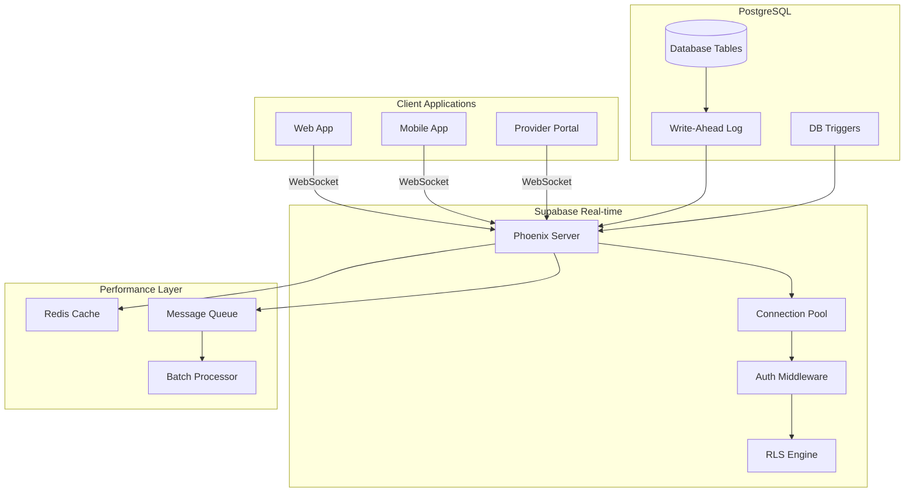
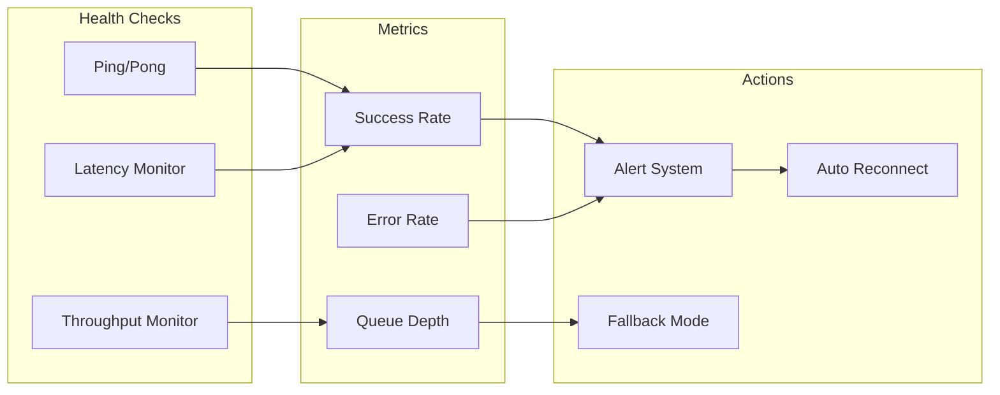
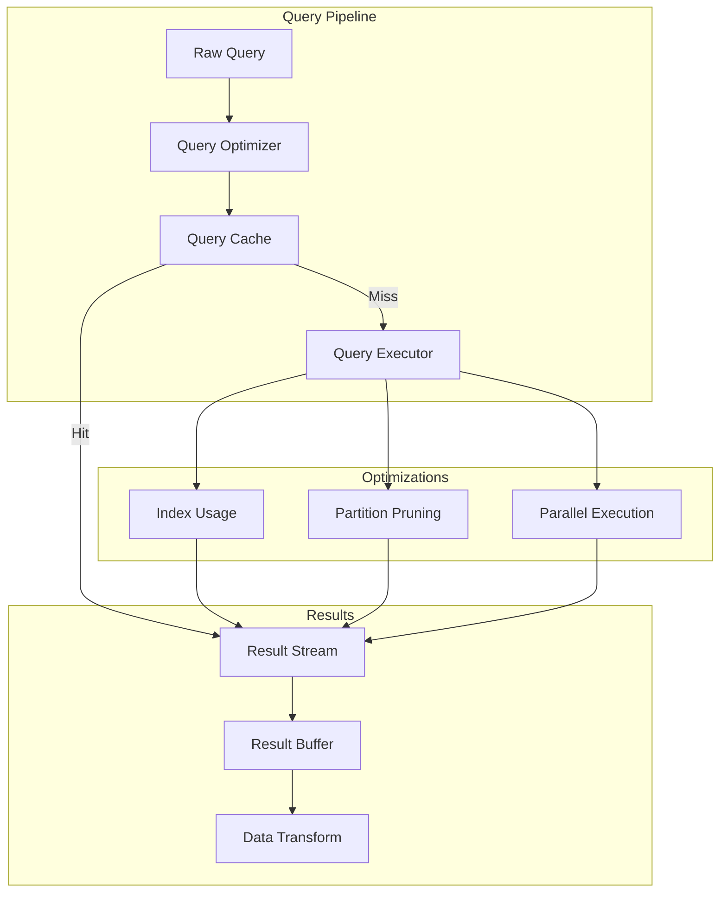

# Real-time Infrastructure with Supabase

## Overview

The TJV Recovery Platform leverages Supabase's real-time capabilities to provide instant updates across the healthcare ecosystem. This infrastructure ensures that patients, providers, and caregivers stay synchronized with live data updates, enabling immediate responses to critical health events and seamless collaboration.

## Core Components

### 1. Supabase Real-time Engine
- PostgreSQL logical replication
- WebSocket connections via Phoenix
- Automatic reconnection handling
- Presence tracking
- Broadcast messaging

### 2. Subscription Management
- Row-level subscriptions
- Table-level changes
- Filtered subscriptions with RLS
- Multi-channel support

### 3. Performance Optimization
- Connection pooling
- Message batching
- Intelligent caching
- Lazy loading strategies

## Architecture Overview



## Real-time Subscription Patterns

### 1. Patient Data Subscriptions

```typescript
// Patient subscribing to their own data updates
class PatientRealtimeService {
  private supabase: SupabaseClient
  private subscriptions: Map<string, RealtimeSubscription>
  
  async subscribeToPatientUpdates(patientId: string) {
    // Subscribe to vital signs updates
    const vitalsChannel = this.supabase
      .channel(`patient-vitals:${patientId}`)
      .on(
        'postgres_changes',
        {
          event: '*',
          schema: 'public',
          table: 'vital_signs',
          filter: `patient_id=eq.${patientId}`
        },
        (payload) => this.handleVitalsUpdate(payload)
      )
      .subscribe()
    
    // Subscribe to message updates
    const messagesChannel = this.supabase
      .channel(`patient-messages:${patientId}`)
      .on(
        'postgres_changes',
        {
          event: 'INSERT',
          schema: 'public',
          table: 'messages',
          filter: `patient_id=eq.${patientId}`
        },
        (payload) => this.handleNewMessage(payload)
      )
      .subscribe()
    
    // Subscribe to care plan updates
    const carePlanChannel = this.supabase
      .channel(`patient-care-plan:${patientId}`)
      .on(
        'postgres_changes',
        {
          event: '*',
          schema: 'public',
          table: 'care_plans',
          filter: `patient_id=eq.${patientId}`
        },
        (payload) => this.handleCarePlanUpdate(payload)
      )
      .subscribe()
    
    this.subscriptions.set(patientId, {
      vitals: vitalsChannel,
      messages: messagesChannel,
      carePlan: carePlanChannel
    })
  }
}
```

### 2. Provider Monitoring Subscriptions

```typescript
// Provider monitoring multiple patients
class ProviderRealtimeService {
  private supabase: SupabaseClient
  private alertThresholds: AlertThresholds
  
  async subscribeToProviderPatients(providerId: string) {
    // Get all assigned patients
    const patients = await this.getAssignedPatients(providerId)
    
    // Subscribe to high-priority alerts across all patients
    const alertChannel = this.supabase
      .channel(`provider-alerts:${providerId}`)
      .on(
        'postgres_changes',
        {
          event: 'INSERT',
          schema: 'public',
          table: 'patient_alerts',
          filter: `provider_id=eq.${providerId}`
        },
        (payload) => this.handlePatientAlert(payload)
      )
      .subscribe()
    
    // Subscribe to patient status changes
    const statusChannel = this.supabase
      .channel(`provider-patient-status:${providerId}`)
      .on(
        'postgres_changes',
        {
          event: 'UPDATE',
          schema: 'public',
          table: 'patient_status',
          filter: `provider_id=eq.${providerId}`
        },
        (payload) => this.handleStatusChange(payload)
      )
      .subscribe()
    
    // Presence tracking for active patients
    const presenceChannel = this.supabase.channel(`provider-presence:${providerId}`)
    
    presenceChannel
      .on('presence', { event: 'sync' }, () => {
        const state = presenceChannel.presenceState()
        this.updateActivePatients(state)
      })
      .subscribe(async (status) => {
        if (status === 'SUBSCRIBED') {
          await presenceChannel.track({
            provider_id: providerId,
            online_at: new Date().toISOString()
          })
        }
      })
  }
}
```

### 3. Multi-tenant Subscription Management

```typescript
interface TenantSubscription {
  tenantId: string
  subscriptions: Map<string, RealtimeChannel>
  lastActivity: Date
  connectionHealth: ConnectionHealth
}

class MultiTenantRealtimeManager {
  private tenantSubscriptions: Map<string, TenantSubscription>
  private connectionMonitor: ConnectionMonitor
  
  async manageTenantSubscriptions(tenantId: string) {
    // Create tenant-specific channels with RLS
    const channels = new Map<string, RealtimeChannel>()
    
    // Organization-wide announcements
    channels.set('announcements', 
      this.supabase
        .channel(`tenant:${tenantId}:announcements`)
        .on('broadcast', { event: 'announcement' }, 
          (payload) => this.handleAnnouncement(tenantId, payload))
    )
    
    // Provider collaboration
    channels.set('collaboration',
      this.supabase
        .channel(`tenant:${tenantId}:collaboration`)
        .on('presence', { event: 'sync' }, () => {
          this.syncProviderPresence(tenantId)
        })
    )
    
    // System metrics
    channels.set('metrics',
      this.supabase
        .channel(`tenant:${tenantId}:metrics`)
        .on('postgres_changes', {
          event: '*',
          schema: 'public',
          table: 'system_metrics',
          filter: `tenant_id=eq.${tenantId}`
        }, (payload) => this.updateMetrics(tenantId, payload))
    )
    
    // Subscribe all channels
    for (const [name, channel] of channels) {
      await channel.subscribe((status) => {
        this.updateConnectionStatus(tenantId, name, status)
      })
    }
    
    this.tenantSubscriptions.set(tenantId, {
      tenantId,
      subscriptions: channels,
      lastActivity: new Date(),
      connectionHealth: { status: 'healthy', latency: 0 }
    })
  }
}
```

## Connection Management

### 1. Automatic Reconnection Strategy

```typescript
class RealtimeConnectionManager {
  private reconnectAttempts: number = 0
  private maxReconnectAttempts: number = 10
  private reconnectInterval: number = 1000
  
  async handleConnectionLoss(channel: RealtimeChannel) {
    console.log('Connection lost, attempting reconnection...')
    
    while (this.reconnectAttempts < this.maxReconnectAttempts) {
      try {
        // Exponential backoff
        const delay = Math.min(
          this.reconnectInterval * Math.pow(2, this.reconnectAttempts),
          30000 // Max 30 seconds
        )
        
        await this.sleep(delay)
        
        // Attempt reconnection
        const status = await channel.subscribe()
        
        if (status === 'SUBSCRIBED') {
          console.log('Successfully reconnected')
          this.reconnectAttempts = 0
          
          // Resync any missed data
          await this.resyncMissedData(channel)
          return
        }
      } catch (error) {
        console.error('Reconnection attempt failed:', error)
        this.reconnectAttempts++
      }
    }
    
    // Max attempts reached
    this.handleReconnectionFailure(channel)
  }
  
  private async resyncMissedData(channel: RealtimeChannel) {
    // Get the last known timestamp
    const lastSync = this.getLastSyncTimestamp(channel)
    
    // Query for any missed updates
    const missedUpdates = await this.supabase
      .from(channel.topic.split(':')[0])
      .select('*')
      .gt('updated_at', lastSync)
      .order('updated_at', { ascending: true })
    
    // Process missed updates
    for (const update of missedUpdates.data || []) {
      await this.processUpdate(update)
    }
    
    // Update sync timestamp
    this.updateLastSyncTimestamp(channel, new Date())
  }
}
```

### 2. Connection Health Monitoring



### 3. Connection Pool Management

```typescript
class ConnectionPoolManager {
  private pool: Map<string, WebSocketConnection>
  private maxConnections: number = 100
  private connectionTimeout: number = 30000
  
  async getConnection(tenantId: string): Promise<WebSocketConnection> {
    // Check for existing healthy connection
    const existing = this.pool.get(tenantId)
    if (existing && existing.isHealthy()) {
      existing.lastUsed = new Date()
      return existing
    }
    
    // Create new connection if under limit
    if (this.pool.size < this.maxConnections) {
      const connection = await this.createConnection(tenantId)
      this.pool.set(tenantId, connection)
      return connection
    }
    
    // Reuse least recently used connection
    const lru = this.findLRUConnection()
    if (lru) {
      await this.reassignConnection(lru, tenantId)
      return lru
    }
    
    throw new Error('Connection pool exhausted')
  }
  
  private async createConnection(tenantId: string): Promise<WebSocketConnection> {
    const connection = new WebSocketConnection({
      url: this.getWebSocketUrl(),
      headers: {
        'X-Tenant-ID': tenantId,
        'Authorization': `Bearer ${await this.getToken()}`
      },
      heartbeatInterval: 30000,
      reconnectOnClose: true
    })
    
    await connection.connect()
    
    // Setup connection monitoring
    connection.on('error', (error) => this.handleConnectionError(tenantId, error))
    connection.on('close', () => this.handleConnectionClose(tenantId))
    
    return connection
  }
}
```

## Performance Optimization Strategies

### 1. Message Batching

```typescript
class MessageBatcher {
  private batchQueue: Map<string, Message[]> = new Map()
  private batchInterval: number = 100 // ms
  private maxBatchSize: number = 50
  
  async queueMessage(channel: string, message: Message) {
    // Add to batch queue
    if (!this.batchQueue.has(channel)) {
      this.batchQueue.set(channel, [])
      
      // Schedule batch processing
      setTimeout(() => this.processBatch(channel), this.batchInterval)
    }
    
    const queue = this.batchQueue.get(channel)!
    queue.push(message)
    
    // Process immediately if batch is full
    if (queue.length >= this.maxBatchSize) {
      await this.processBatch(channel)
    }
  }
  
  private async processBatch(channel: string) {
    const messages = this.batchQueue.get(channel) || []
    if (messages.length === 0) return
    
    // Clear the queue
    this.batchQueue.delete(channel)
    
    // Send batched update
    await this.supabase.channel(channel).send({
      type: 'broadcast',
      event: 'batch_update',
      payload: { messages }
    })
    
    // Update metrics
    this.metrics.recordBatch(channel, messages.length)
  }
}
```

### 2. Intelligent Caching

```typescript
interface CacheStrategy {
  ttl: number
  maxSize: number
  evictionPolicy: 'LRU' | 'LFU' | 'FIFO'
  compressionEnabled: boolean
}

class RealtimeCache {
  private cache: Map<string, CachedData>
  private strategy: CacheStrategy
  
  async getCachedOrSubscribe<T>(
    key: string,
    subscriptionFactory: () => RealtimeChannel
  ): Promise<T> {
    // Check cache first
    const cached = this.cache.get(key)
    if (cached && !this.isExpired(cached)) {
      this.updateAccessMetrics(key)
      return cached.data as T
    }
    
    // Subscribe and cache
    const channel = subscriptionFactory()
    const data = await new Promise<T>((resolve) => {
      channel
        .on('postgres_changes', { event: '*' }, (payload) => {
          const data = payload.new as T
          
          // Update cache
          this.cache.set(key, {
            data,
            timestamp: new Date(),
            accessCount: 1,
            size: this.calculateSize(data)
          })
          
          resolve(data)
        })
        .subscribe()
    })
    
    // Ensure cache size limits
    this.enforceMaxSize()
    
    return data
  }
  
  private enforceMaxSize() {
    if (this.cache.size <= this.strategy.maxSize) return
    
    switch (this.strategy.evictionPolicy) {
      case 'LRU':
        this.evictLeastRecentlyUsed()
        break
      case 'LFU':
        this.evictLeastFrequentlyUsed()
        break
      case 'FIFO':
        this.evictFirstInFirstOut()
        break
    }
  }
}
```

### 3. Query Optimization



## Real-time Data Patterns

### 1. Event Sourcing Pattern

```typescript
interface HealthEvent {
  id: string
  patientId: string
  eventType: string
  payload: any
  timestamp: Date
  version: number
}

class EventSourcingRealtime {
  private eventStore: EventStore
  private projections: Map<string, Projection>
  
  async publishEvent(event: HealthEvent) {
    // Store event
    await this.eventStore.append(event)
    
    // Broadcast via real-time
    await this.supabase
      .channel(`events:${event.patientId}`)
      .send({
        type: 'broadcast',
        event: 'health_event',
        payload: event
      })
    
    // Update projections
    for (const projection of this.projections.values()) {
      await projection.handle(event)
    }
  }
  
  async subscribeToEvents(
    patientId: string,
    handler: (event: HealthEvent) => void
  ) {
    // Subscribe to real-time events
    const channel = this.supabase
      .channel(`events:${patientId}`)
      .on('broadcast', { event: 'health_event' }, ({ payload }) => {
        handler(payload as HealthEvent)
      })
      .subscribe()
    
    // Replay missed events
    const lastProcessed = await this.getLastProcessedEvent(patientId)
    const missedEvents = await this.eventStore.getEventsSince(lastProcessed)
    
    for (const event of missedEvents) {
      handler(event)
    }
    
    return channel
  }
}
```

### 2. CQRS with Real-time Updates

```typescript
// Command side
class PatientCommandService {
  async updateVitalSigns(command: UpdateVitalsCommand) {
    // Validate command
    await this.validator.validate(command)
    
    // Execute command
    const result = await this.supabase
      .from('vital_signs')
      .upsert({
        patient_id: command.patientId,
        ...command.vitals,
        updated_at: new Date().toISOString()
      })
    
    // Publish domain event
    await this.publishEvent({
      type: 'VitalSignsUpdated',
      patientId: command.patientId,
      vitals: command.vitals,
      timestamp: new Date()
    })
    
    return result
  }
}

// Query side with real-time sync
class PatientQueryService {
  private cache: PatientViewCache
  
  async getPatientDashboard(patientId: string): Promise<PatientDashboard> {
    // Get from cache or build
    let dashboard = await this.cache.get(patientId)
    
    if (!dashboard) {
      dashboard = await this.buildDashboard(patientId)
      await this.cache.set(patientId, dashboard)
    }
    
    // Subscribe to updates
    this.subscribeToUpdates(patientId, dashboard)
    
    return dashboard
  }
  
  private subscribeToUpdates(patientId: string, dashboard: PatientDashboard) {
    this.supabase
      .channel(`patient-updates:${patientId}`)
      .on('postgres_changes', 
        { event: '*', schema: 'public', table: '*', filter: `patient_id=eq.${patientId}` },
        async (payload) => {
          // Update specific part of dashboard
          switch (payload.table) {
            case 'vital_signs':
              dashboard.vitals = payload.new
              break
            case 'medications':
              dashboard.medications = await this.getMedications(patientId)
              break
            case 'exercises':
              dashboard.exercises = await this.getExercises(patientId)
              break
          }
          
          // Notify UI
          this.notifyUpdate(patientId, dashboard)
        }
      )
      .subscribe()
  }
}
```

### 3. Collaborative Features

```typescript
class CollaborativeSession {
  private sessionId: string
  private participants: Map<string, Participant>
  private sharedState: SharedState
  
  async startSession(sessionConfig: SessionConfig) {
    this.sessionId = generateSessionId()
    
    // Create presence channel
    const presenceChannel = this.supabase.channel(`session:${this.sessionId}`, {
      config: {
        presence: {
          key: sessionConfig.userId
        }
      }
    })
    
    // Track presence
    presenceChannel
      .on('presence', { event: 'sync' }, () => {
        const state = presenceChannel.presenceState()
        this.updateParticipants(state)
      })
      .on('presence', { event: 'join' }, ({ key, newPresences }) => {
        this.handleParticipantJoin(key, newPresences)
      })
      .on('presence', { event: 'leave' }, ({ key, leftPresences }) => {
        this.handleParticipantLeave(key, leftPresences)
      })
    
    // Shared state synchronization
    presenceChannel
      .on('broadcast', { event: 'state_update' }, ({ payload }) => {
        this.mergeSharedState(payload)
      })
      .on('broadcast', { event: 'cursor_move' }, ({ payload }) => {
        this.updateCursor(payload.userId, payload.position)
      })
    
    await presenceChannel.subscribe()
    
    // Announce presence
    await presenceChannel.track({
      userId: sessionConfig.userId,
      name: sessionConfig.userName,
      role: sessionConfig.userRole,
      joinedAt: new Date().toISOString()
    })
  }
  
  async updateSharedState(update: StateUpdate) {
    // Apply optimistic update
    this.sharedState = this.applyUpdate(this.sharedState, update)
    
    // Broadcast to other participants
    await this.supabase
      .channel(`session:${this.sessionId}`)
      .send({
        type: 'broadcast',
        event: 'state_update',
        payload: update
      })
  }
}
```

## Monitoring and Observability

### 1. Real-time Metrics Dashboard

```typescript
interface RealtimeMetrics {
  connections: {
    active: number
    total: number
    byTenant: Map<string, number>
  }
  messages: {
    inbound: number
    outbound: number
    queued: number
    failed: number
  }
  performance: {
    avgLatency: number
    p95Latency: number
    p99Latency: number
    throughput: number
  }
  errors: {
    connectionErrors: number
    authErrors: number
    subscriptionErrors: number
  }
}

class RealtimeMonitor {
  private metrics: RealtimeMetrics
  private metricsChannel: RealtimeChannel
  
  async startMonitoring() {
    // Subscribe to metrics updates
    this.metricsChannel = this.supabase
      .channel('realtime-metrics')
      .on('postgres_changes', 
        { event: '*', schema: 'metrics', table: 'realtime_stats' },
        (payload) => this.updateMetrics(payload)
      )
      .subscribe()
    
    // Periodic health checks
    setInterval(() => this.performHealthCheck(), 5000)
    
    // Alert on anomalies
    this.setupAnomalyDetection()
  }
  
  private setupAnomalyDetection() {
    // High latency detection
    if (this.metrics.performance.p99Latency > 1000) {
      this.alert({
        level: 'warning',
        message: 'High real-time latency detected',
        metric: 'p99_latency',
        value: this.metrics.performance.p99Latency
      })
    }
    
    // Connection spike detection
    const connectionSpike = this.detectConnectionSpike()
    if (connectionSpike) {
      this.alert({
        level: 'info',
        message: 'Connection spike detected',
        metric: 'active_connections',
        value: this.metrics.connections.active
      })
    }
  }
}
```

### 2. Debug and Trace System

```typescript
class RealtimeDebugger {
  private traceEnabled: boolean = false
  private traceBuffer: CircularBuffer<TraceEvent>
  
  async enableTracing(options: TraceOptions) {
    this.traceEnabled = true
    
    // Intercept all real-time events
    this.supabase.channel('*')
      .on('*', { event: '*' }, (payload) => {
        this.recordTrace({
          timestamp: new Date(),
          channel: payload.channel,
          event: payload.event,
          payload: this.sanitizePayload(payload),
          metadata: {
            size: JSON.stringify(payload).length,
            latency: this.calculateLatency(payload)
          }
        })
      })
  }
  
  async captureDebugSnapshot(): Promise<DebugSnapshot> {
    return {
      timestamp: new Date(),
      connections: await this.getActiveConnections(),
      subscriptions: await this.getActiveSubscriptions(),
      messageQueue: await this.getQueuedMessages(),
      recentErrors: this.getRecentErrors(),
      performanceMetrics: await this.getPerformanceMetrics(),
      traceEvents: this.traceBuffer.toArray()
    }
  }
}
```

## Security Considerations

### 1. Channel Authorization

```typescript
class ChannelAuthorizationService {
  async authorizeChannelAccess(
    userId: string,
    channel: string,
    operation: 'read' | 'write'
  ): Promise<boolean> {
    // Parse channel type and resource
    const { type, resourceId } = this.parseChannel(channel)
    
    // Check permissions based on channel type
    switch (type) {
      case 'patient':
        return await this.authorizePatientChannel(userId, resourceId, operation)
      
      case 'provider':
        return await this.authorizeProviderChannel(userId, resourceId, operation)
      
      case 'tenant':
        return await this.authorizeTenantChannel(userId, resourceId, operation)
      
      default:
        return false
    }
  }
  
  private async authorizePatientChannel(
    userId: string,
    patientId: string,
    operation: 'read' | 'write'
  ): Promise<boolean> {
    // Patients can only access their own data
    const user = await this.getUser(userId)
    
    if (user.role === 'patient') {
      return user.patientId === patientId
    }
    
    // Providers can access assigned patients
    if (user.role === 'provider') {
      const assignment = await this.checkProviderAssignment(user.providerId, patientId)
      return assignment.isActive && (
        operation === 'read' || 
        assignment.permissions.includes('write')
      )
    }
    
    return false
  }
}
```

### 2. Message Encryption

```typescript
class RealtimeEncryption {
  private encryptionKey: CryptoKey
  
  async encryptMessage(message: any): Promise<EncryptedMessage> {
    const plaintext = JSON.stringify(message)
    const iv = crypto.getRandomValues(new Uint8Array(12))
    
    const encrypted = await crypto.subtle.encrypt(
      {
        name: 'AES-GCM',
        iv: iv
      },
      this.encryptionKey,
      new TextEncoder().encode(plaintext)
    )
    
    return {
      encrypted: btoa(String.fromCharCode(...new Uint8Array(encrypted))),
      iv: btoa(String.fromCharCode(...iv)),
      algorithm: 'AES-GCM'
    }
  }
  
  async decryptMessage(encrypted: EncryptedMessage): Promise<any> {
    const ciphertext = Uint8Array.from(atob(encrypted.encrypted), c => c.charCodeAt(0))
    const iv = Uint8Array.from(atob(encrypted.iv), c => c.charCodeAt(0))
    
    const decrypted = await crypto.subtle.decrypt(
      {
        name: 'AES-GCM',
        iv: iv
      },
      this.encryptionKey,
      ciphertext
    )
    
    return JSON.parse(new TextDecoder().decode(decrypted))
  }
}
```

## Future Enhancements

### 1. WebRTC Integration
- Direct peer-to-peer video consultations
- Screen sharing for provider collaboration
- Real-time biometric streaming

### 2. Edge Computing
- Local real-time processing
- Reduced latency for critical alerts
- Offline-first architecture

### 3. AI-Powered Optimizations
- Predictive pre-fetching
- Intelligent subscription management
- Anomaly detection and auto-healing