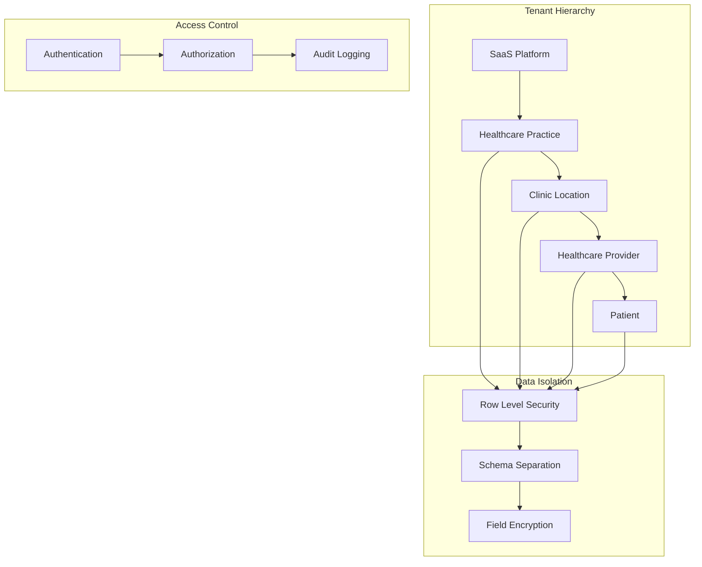
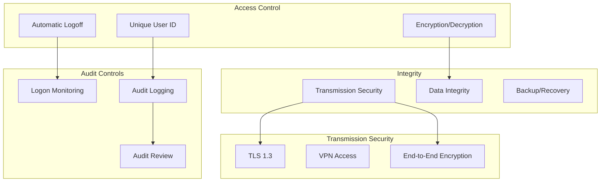
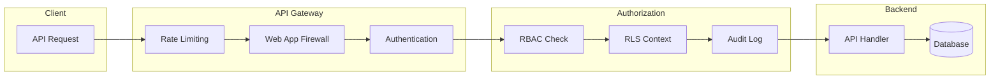
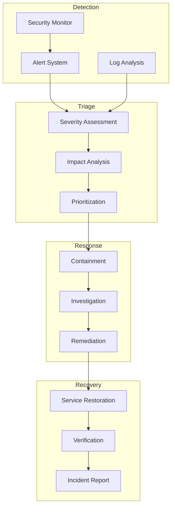

# Multi-tenant Security Architecture

## Overview

The TJV Recovery Platform implements a comprehensive security architecture designed to ensure complete data isolation between tenants while maintaining HIPAA compliance. The multi-tenant hierarchy (SaaS → Practice → Clinic → Provider → Patient) is enforced at every level through Row Level Security (RLS) policies, authentication, and audit controls.

## Security Principles

### 1. Zero Trust Architecture
- Every request is authenticated and authorized
- No implicit trust between components
- Continuous verification of permissions
- Principle of least privilege

### 2. Defense in Depth
- Multiple layers of security controls
- Database-level RLS policies
- Application-level authorization
- API gateway protection
- Network segmentation

### 3. HIPAA Compliance
- End-to-end encryption
- Comprehensive audit logging
- Access controls and monitoring
- Data retention policies
- Business Associate Agreements (BAAs)

## Multi-tenant Data Model



## Row Level Security (RLS) Implementation

### 1. Base RLS Policies

```sql
-- Enable RLS on all tables
ALTER TABLE patients ENABLE ROW LEVEL SECURITY;
ALTER TABLE providers ENABLE ROW LEVEL SECURITY;
ALTER TABLE clinics ENABLE ROW LEVEL SECURITY;
ALTER TABLE practices ENABLE ROW LEVEL SECURITY;

-- Practice-level isolation
CREATE POLICY "practice_isolation" ON practices
    FOR ALL
    TO authenticated
    USING (
        id IN (
            SELECT practice_id 
            FROM user_practice_access 
            WHERE user_id = auth.uid()
        )
    );

-- Clinic-level isolation (inherits practice access)
CREATE POLICY "clinic_isolation" ON clinics
    FOR ALL
    TO authenticated
    USING (
        practice_id IN (
            SELECT practice_id 
            FROM user_practice_access 
            WHERE user_id = auth.uid()
        )
        AND
        id IN (
            SELECT clinic_id 
            FROM user_clinic_access 
            WHERE user_id = auth.uid()
        )
    );

-- Patient data access
CREATE POLICY "patient_data_access" ON patients
    FOR ALL
    TO authenticated
    USING (
        -- Patients can only see their own data
        (auth.uid() = user_id)
        OR
        -- Providers can see assigned patients
        (id IN (
            SELECT patient_id 
            FROM provider_patient_assignments 
            WHERE provider_id IN (
                SELECT provider_id 
                FROM providers 
                WHERE user_id = auth.uid()
            )
            AND is_active = true
        ))
        OR
        -- Practice admins can see all patients in their practice
        (practice_id IN (
            SELECT practice_id 
            FROM user_roles 
            WHERE user_id = auth.uid() 
            AND role = 'practice_admin'
        ))
    );
```

### 2. Hierarchical Permission Model

```typescript
interface PermissionHierarchy {
  saas_admin: {
    can_access: ['all_practices', 'all_clinics', 'all_providers', 'all_patients']
    can_manage: ['system_settings', 'tenant_creation', 'billing']
  }
  
  practice_admin: {
    can_access: ['own_practice', 'subordinate_clinics', 'subordinate_providers', 'subordinate_patients']
    can_manage: ['practice_settings', 'clinic_creation', 'provider_onboarding']
  }
  
  clinic_admin: {
    can_access: ['own_clinic', 'subordinate_providers', 'subordinate_patients']
    can_manage: ['clinic_settings', 'provider_schedules', 'patient_assignments']
  }
  
  provider: {
    can_access: ['assigned_patients', 'own_schedule', 'clinic_resources']
    can_manage: ['patient_care_plans', 'patient_notes', 'prescriptions']
  }
  
  patient: {
    can_access: ['own_health_data', 'assigned_providers', 'care_plans']
    can_manage: ['personal_info', 'preferences', 'consents']
  }
}
```

### 3. Dynamic RLS Context

```typescript
class RLSContext {
  private supabase: SupabaseClient
  
  async setUserContext(userId: string) {
    // Set the authenticated user context for RLS
    const { data: user } = await this.supabase
      .from('users')
      .select(`
        id,
        role,
        user_practice_access (
          practice_id,
          role
        ),
        user_clinic_access (
          clinic_id,
          permissions
        )
      `)
      .eq('id', userId)
      .single()
    
    // Create JWT with user context
    const token = await this.generateContextToken(user)
    
    // Set context for subsequent queries
    this.supabase.auth.setSession({
      access_token: token,
      refresh_token: user.refresh_token
    })
  }
  
  private async generateContextToken(user: User): Promise<string> {
    return jwt.sign({
      sub: user.id,
      role: user.role,
      practice_access: user.user_practice_access,
      clinic_access: user.user_clinic_access,
      iat: Math.floor(Date.now() / 1000),
      exp: Math.floor(Date.now() / 1000) + (60 * 60) // 1 hour
    }, process.env.JWT_SECRET!)
  }
}
```

## HIPAA Compliance Architecture

### 1. Technical Safeguards



### 2. PHI Encryption Implementation

```typescript
class PHIEncryption {
  private encryptionKey: string
  private algorithm = 'aes-256-gcm'
  
  // Field-level encryption for sensitive data
  async encryptPHI(data: any, fields: string[]): Promise<EncryptedData> {
    const encrypted: any = { ...data }
    
    for (const field of fields) {
      if (data[field]) {
        const { ciphertext, iv, tag } = await this.encrypt(data[field])
        encrypted[field] = {
          encrypted: true,
          ciphertext,
          iv,
          tag,
          algorithm: this.algorithm
        }
      }
    }
    
    return encrypted
  }
  
  // Transparent decryption for authorized users
  async decryptPHI(data: any): Promise<any> {
    const decrypted: any = { ...data }
    
    for (const [key, value] of Object.entries(data)) {
      if (value && typeof value === 'object' && value.encrypted) {
        try {
          decrypted[key] = await this.decrypt(value)
        } catch (error) {
          // Log failed decryption attempts
          await this.auditFailedDecryption(key, error)
          decrypted[key] = '[ENCRYPTED]'
        }
      }
    }
    
    return decrypted
  }
  
  private async encrypt(plaintext: string): Promise<EncryptedField> {
    const iv = crypto.randomBytes(16)
    const cipher = crypto.createCipheriv(this.algorithm, this.encryptionKey, iv)
    
    let ciphertext = cipher.update(plaintext, 'utf8', 'hex')
    ciphertext += cipher.final('hex')
    
    const tag = cipher.getAuthTag()
    
    return {
      ciphertext,
      iv: iv.toString('hex'),
      tag: tag.toString('hex')
    }
  }
}
```

### 3. Audit Logging System

```typescript
interface AuditEvent {
  id: string
  timestamp: Date
  user_id: string
  user_role: string
  action: string
  resource_type: string
  resource_id: string
  ip_address: string
  user_agent: string
  success: boolean
  error_message?: string
  metadata?: Record<string, any>
}

class AuditLogger {
  private auditQueue: Queue<AuditEvent>
  
  async logAccess(params: {
    userId: string
    action: string
    resourceType: string
    resourceId: string
    success: boolean
    metadata?: any
  }) {
    const event: AuditEvent = {
      id: generateUUID(),
      timestamp: new Date(),
      user_id: params.userId,
      user_role: await this.getUserRole(params.userId),
      action: params.action,
      resource_type: params.resourceType,
      resource_id: params.resourceId,
      ip_address: this.getClientIP(),
      user_agent: this.getUserAgent(),
      success: params.success,
      metadata: params.metadata
    }
    
    // Queue for async processing
    await this.auditQueue.add(event)
    
    // Real-time alerting for sensitive actions
    if (this.isSensitiveAction(params.action)) {
      await this.alertSecurityTeam(event)
    }
  }
  
  private isSensitiveAction(action: string): boolean {
    const sensitiveActions = [
      'export_patient_data',
      'modify_security_settings',
      'access_denied',
      'authentication_failure',
      'bulk_data_access'
    ]
    
    return sensitiveActions.includes(action)
  }
  
  async generateComplianceReport(
    startDate: Date,
    endDate: Date
  ): Promise<ComplianceReport> {
    const events = await this.queryAuditLog({
      start: startDate,
      end: endDate
    })
    
    return {
      period: { start: startDate, end: endDate },
      totalAccess: events.length,
      uniqueUsers: new Set(events.map(e => e.user_id)).size,
      accessByRole: this.groupByRole(events),
      accessByResource: this.groupByResource(events),
      failedAttempts: events.filter(e => !e.success),
      anomalies: await this.detectAnomalies(events)
    }
  }
}
```

## Authentication & Authorization

### 1. Multi-factor Authentication

```typescript
class MFAService {
  async setupMFA(userId: string, method: 'totp' | 'sms' | 'email') {
    switch (method) {
      case 'totp':
        return await this.setupTOTP(userId)
      case 'sms':
        return await this.setupSMS(userId)
      case 'email':
        return await this.setupEmail(userId)
    }
  }
  
  private async setupTOTP(userId: string): Promise<TOTPSetup> {
    // Generate secret
    const secret = speakeasy.generateSecret({
      name: 'TJV Recovery Platform',
      issuer: 'TJV Health'
    })
    
    // Store encrypted secret
    await this.supabase
      .from('user_mfa')
      .upsert({
        user_id: userId,
        method: 'totp',
        secret_encrypted: await this.encryptSecret(secret.base32),
        backup_codes: await this.generateBackupCodes(),
        created_at: new Date()
      })
    
    // Generate QR code
    const qrCode = await qrcode.toDataURL(secret.otpauth_url)
    
    return {
      secret: secret.base32,
      qrCode,
      backupCodes: await this.getBackupCodes(userId)
    }
  }
  
  async verifyMFA(
    userId: string,
    token: string,
    method: 'totp' | 'sms' | 'email'
  ): Promise<boolean> {
    const mfaConfig = await this.getMFAConfig(userId)
    
    if (!mfaConfig || mfaConfig.method !== method) {
      await this.logFailedMFA(userId, method)
      return false
    }
    
    const isValid = await this.verifyToken(mfaConfig, token)
    
    if (isValid) {
      await this.logSuccessfulMFA(userId, method)
      await this.updateLastMFA(userId)
    } else {
      await this.logFailedMFA(userId, method)
    }
    
    return isValid
  }
}
```

### 2. Role-Based Access Control (RBAC)

```typescript
interface Role {
  id: string
  name: string
  permissions: Permission[]
  inherit_from?: string
}

interface Permission {
  resource: string
  actions: ('create' | 'read' | 'update' | 'delete')[]
  conditions?: Record<string, any>
}

class RBACService {
  private roleCache: Map<string, Role>
  
  async checkPermission(
    userId: string,
    resource: string,
    action: string
  ): Promise<boolean> {
    // Get user's roles
    const userRoles = await this.getUserRoles(userId)
    
    // Check each role
    for (const role of userRoles) {
      const hasPermission = await this.roleHasPermission(role, resource, action)
      if (hasPermission) {
        await this.logPermissionGrant(userId, role.id, resource, action)
        return true
      }
    }
    
    await this.logPermissionDenial(userId, resource, action)
    return false
  }
  
  private async roleHasPermission(
    role: Role,
    resource: string,
    action: string
  ): Promise<boolean> {
    // Check direct permissions
    const permission = role.permissions.find(p => 
      p.resource === resource && p.actions.includes(action as any)
    )
    
    if (permission) {
      // Evaluate conditions if present
      if (permission.conditions) {
        return await this.evaluateConditions(permission.conditions)
      }
      return true
    }
    
    // Check inherited permissions
    if (role.inherit_from) {
      const parentRole = await this.getRole(role.inherit_from)
      return await this.roleHasPermission(parentRole, resource, action)
    }
    
    return false
  }
}
```

### 3. API Security Layer



## Data Isolation Patterns

### 1. Schema-based Isolation

```sql
-- Create tenant-specific schemas
CREATE SCHEMA IF NOT EXISTS tenant_12345;

-- Set search path for tenant
SET search_path TO tenant_12345, public;

-- Create tenant tables within schema
CREATE TABLE tenant_12345.patients (
    id UUID PRIMARY KEY DEFAULT gen_random_uuid(),
    -- Patient fields
    created_at TIMESTAMPTZ DEFAULT NOW()
);

-- Cross-tenant query prevention
CREATE OR REPLACE FUNCTION prevent_cross_tenant_access()
RETURNS TRIGGER AS $$
BEGIN
    IF current_setting('app.current_tenant', true) IS NULL THEN
        RAISE EXCEPTION 'Tenant context not set';
    END IF;
    
    IF NEW.tenant_id != current_setting('app.current_tenant')::UUID THEN
        RAISE EXCEPTION 'Cross-tenant access violation';
    END IF;
    
    RETURN NEW;
END;
$$ LANGUAGE plpgsql;
```

### 2. Connection Pool Isolation

```typescript
class TenantConnectionPool {
  private pools: Map<string, Pool>
  private maxPoolsPerTenant = 10
  
  async getConnection(tenantId: string): Promise<PoolClient> {
    // Get or create tenant-specific pool
    let pool = this.pools.get(tenantId)
    
    if (!pool) {
      pool = new Pool({
        connectionString: process.env.DATABASE_URL,
        max: this.maxPoolsPerTenant,
        idleTimeoutMillis: 30000,
        connectionTimeoutMillis: 2000,
        // Set tenant context on connection
        query_init: async (client) => {
          await client.query('SET app.current_tenant = $1', [tenantId])
          await client.query('SET row_security = on')
        }
      })
      
      this.pools.set(tenantId, pool)
    }
    
    const client = await pool.connect()
    
    // Ensure tenant context is set
    await client.query('SET app.current_tenant = $1', [tenantId])
    
    return client
  }
  
  async executeInTenantContext<T>(
    tenantId: string,
    fn: (client: PoolClient) => Promise<T>
  ): Promise<T> {
    const client = await this.getConnection(tenantId)
    
    try {
      return await fn(client)
    } finally {
      client.release()
    }
  }
}
```

### 3. Query-time Tenant Filtering

```typescript
class TenantAwareRepository<T> {
  constructor(
    private tableName: string,
    private tenantField: string = 'tenant_id'
  ) {}
  
  async findAll(tenantId: string, filters?: any): Promise<T[]> {
    const query = this.supabase
      .from(this.tableName)
      .select('*')
      .eq(this.tenantField, tenantId)
    
    // Apply additional filters
    if (filters) {
      Object.entries(filters).forEach(([key, value]) => {
        query.eq(key, value)
      })
    }
    
    const { data, error } = await query
    
    if (error) {
      await this.logQueryError(error, tenantId)
      throw error
    }
    
    return data as T[]
  }
  
  async create(tenantId: string, data: Partial<T>): Promise<T> {
    // Ensure tenant ID is always set
    const dataWithTenant = {
      ...data,
      [this.tenantField]: tenantId
    }
    
    const { data: created, error } = await this.supabase
      .from(this.tableName)
      .insert(dataWithTenant)
      .select()
      .single()
    
    if (error) {
      await this.logQueryError(error, tenantId)
      throw error
    }
    
    return created as T
  }
}
```

## Security Monitoring & Incident Response

### 1. Real-time Security Monitoring

```typescript
class SecurityMonitor {
  private alertThresholds = {
    failedLogins: 5,
    dataExports: 10,
    privilegeEscalations: 1,
    suspiciousQueries: 3
  }
  
  async monitorSecurityEvents() {
    // Subscribe to security events
    this.supabase
      .channel('security-events')
      .on('postgres_changes', {
        event: 'INSERT',
        schema: 'audit',
        table: 'security_events'
      }, async (payload) => {
        await this.analyzeSecurityEvent(payload.new)
      })
      .subscribe()
  }
  
  private async analyzeSecurityEvent(event: SecurityEvent) {
    // Check for patterns
    const patterns = await this.detectPatterns(event)
    
    if (patterns.includes('brute_force')) {
      await this.handleBruteForce(event)
    }
    
    if (patterns.includes('data_exfiltration')) {
      await this.handleDataExfiltration(event)
    }
    
    if (patterns.includes('privilege_escalation')) {
      await this.handlePrivilegeEscalation(event)
    }
    
    // Update security metrics
    await this.updateSecurityMetrics(event, patterns)
  }
  
  private async handleBruteForce(event: SecurityEvent) {
    // Lock account after threshold
    const recentFailures = await this.getRecentFailures(event.user_id)
    
    if (recentFailures >= this.alertThresholds.failedLogins) {
      await this.lockAccount(event.user_id)
      await this.notifySecurityTeam({
        type: 'brute_force_detected',
        user_id: event.user_id,
        ip_address: event.ip_address,
        attempts: recentFailures
      })
    }
  }
}
```

### 2. Incident Response Workflow



### 3. Automated Response Actions

```typescript
class IncidentResponse {
  async executeResponse(incident: SecurityIncident) {
    const response = await this.determineResponse(incident)
    
    switch (response.action) {
      case 'isolate_account':
        await this.isolateAccount(incident.affected_users)
        break
        
      case 'revoke_sessions':
        await this.revokeAllSessions(incident.affected_users)
        break
        
      case 'block_ip':
        await this.blockIPAddress(incident.source_ip)
        break
        
      case 'enable_readonly':
        await this.enableReadOnlyMode(incident.affected_tenant)
        break
        
      case 'full_lockdown':
        await this.initiateFullLockdown()
        break
    }
    
    // Document response
    await this.documentResponse(incident, response)
    
    // Notify stakeholders
    await this.notifyStakeholders(incident, response)
  }
  
  private async isolateAccount(userIds: string[]) {
    for (const userId of userIds) {
      // Revoke all access
      await this.supabase
        .from('users')
        .update({ 
          is_active: false,
          lockout_reason: 'security_incident',
          lockout_timestamp: new Date()
        })
        .eq('id', userId)
      
      // Terminate active sessions
      await this.auth.revokeAllSessions(userId)
      
      // Log action
      await this.auditLog.log({
        action: 'account_isolated',
        user_id: userId,
        reason: 'security_incident'
      })
    }
  }
}
```

## Compliance Automation

### 1. Consent Management

```typescript
interface Consent {
  id: string
  patient_id: string
  type: 'data_sharing' | 'marketing' | 'research' | 'third_party'
  granted: boolean
  granted_at?: Date
  revoked_at?: Date
  ip_address: string
  version: string
}

class ConsentManager {
  async recordConsent(params: {
    patientId: string
    type: Consent['type']
    granted: boolean
  }): Promise<Consent> {
    const consent = await this.supabase
      .from('patient_consents')
      .insert({
        patient_id: params.patientId,
        type: params.type,
        granted: params.granted,
        granted_at: params.granted ? new Date() : null,
        revoked_at: !params.granted ? new Date() : null,
        ip_address: this.getClientIP(),
        version: await this.getCurrentConsentVersion(params.type)
      })
      .select()
      .single()
    
    // Propagate consent changes
    await this.propagateConsentChange(consent)
    
    return consent
  }
  
  async checkConsent(
    patientId: string,
    type: Consent['type']
  ): Promise<boolean> {
    const { data: consent } = await this.supabase
      .from('patient_consents')
      .select('*')
      .eq('patient_id', patientId)
      .eq('type', type)
      .order('created_at', { ascending: false })
      .limit(1)
      .single()
    
    return consent?.granted || false
  }
  
  async enforceConsent<T>(
    patientId: string,
    requiredConsents: Consent['type'][],
    operation: () => Promise<T>
  ): Promise<T> {
    // Check all required consents
    for (const consentType of requiredConsents) {
      const hasConsent = await this.checkConsent(patientId, consentType)
      
      if (!hasConsent) {
        throw new ConsentRequiredError(consentType)
      }
    }
    
    // Execute operation with consent verified
    return await operation()
  }
}
```

### 2. Data Retention Policies

```typescript
class DataRetentionService {
  private retentionPolicies = {
    medical_records: { years: 7, required_by: 'HIPAA' },
    audit_logs: { years: 6, required_by: 'HIPAA' },
    chat_messages: { years: 3, required_by: 'Internal Policy' },
    analytics_data: { days: 90, required_by: 'Privacy Policy' }
  }
  
  async enforceRetentionPolicies() {
    for (const [dataType, policy] of Object.entries(this.retentionPolicies)) {
      await this.enforcePolicy(dataType, policy)
    }
  }
  
  private async enforcePolicy(
    dataType: string,
    policy: RetentionPolicy
  ) {
    const cutoffDate = this.calculateCutoffDate(policy)
    
    // Archive data before deletion
    const toArchive = await this.getDataForArchival(dataType, cutoffDate)
    await this.archiveData(toArchive)
    
    // Delete expired data
    const deleted = await this.deleteExpiredData(dataType, cutoffDate)
    
    // Log retention action
    await this.auditLog.log({
      action: 'data_retention_enforced',
      data_type: dataType,
      records_archived: toArchive.length,
      records_deleted: deleted,
      policy: policy.required_by
    })
  }
}
```

### 3. Access Reports

```typescript
class ComplianceReporting {
  async generateAccessReport(params: {
    patientId: string
    startDate: Date
    endDate: Date
  }): Promise<PatientAccessReport> {
    // Get all access events
    const accessEvents = await this.supabase
      .from('audit_logs')
      .select('*')
      .eq('resource_type', 'patient_data')
      .eq('resource_id', params.patientId)
      .gte('timestamp', params.startDate)
      .lte('timestamp', params.endDate)
      .order('timestamp', { ascending: false })
    
    // Group by accessor
    const accessByUser = this.groupAccessByUser(accessEvents.data)
    
    // Generate report
    return {
      patient_id: params.patientId,
      period: {
        start: params.startDate,
        end: params.endDate
      },
      total_access_count: accessEvents.data.length,
      unique_accessors: Object.keys(accessByUser).length,
      access_details: accessByUser,
      data_shared: await this.getDataSharingEvents(params.patientId, params.startDate, params.endDate),
      report_generated: new Date(),
      report_id: generateReportId()
    }
  }
  
  async generateComplianceAudit(): Promise<ComplianceAuditReport> {
    const auditPeriod = {
      start: subMonths(new Date(), 1),
      end: new Date()
    }
    
    return {
      audit_period: auditPeriod,
      access_controls: await this.auditAccessControls(),
      encryption_status: await this.auditEncryption(),
      retention_compliance: await this.auditRetention(),
      consent_compliance: await this.auditConsents(),
      security_incidents: await this.getSecurityIncidents(auditPeriod),
      training_compliance: await this.auditTrainingCompliance(),
      risk_assessment: await this.performRiskAssessment()
    }
  }
}
```

## Best Practices & Guidelines

### 1. Secure Development Lifecycle

```mermaid
graph LR
    subgraph "Design"
        ThreatModel[Threat Modeling]
        SecReq[Security Requirements]
    end
    
    subgraph "Development"
        SecCoding[Secure Coding]
        CodeReview[Code Review]
        SAST[Static Analysis]
    end
    
    subgraph "Testing"
        SecTest[Security Testing]
        PenTest[Penetration Testing]
        DAST[Dynamic Analysis]
    end
    
    subgraph "Deployment"
        SecConfig[Secure Config]
        Hardening[Hardening]
        Monitor[Monitoring]
    end
    
    ThreatModel --> SecReq
    SecReq --> SecCoding
    SecCoding --> CodeReview
    CodeReview --> SAST
    
    SAST --> SecTest
    SecTest --> PenTest
    PenTest --> DAST
    
    DAST --> SecConfig
    SecConfig --> Hardening
    Hardening --> Monitor
```



### 2. Security Checklist

```typescript
interface SecurityChecklist {
  authentication: {
    mfa_enabled: boolean
    session_timeout: number
    password_complexity: boolean
    account_lockout: boolean
  }
  
  authorization: {
    rbac_implemented: boolean
    least_privilege: boolean
    separation_of_duties: boolean
  }
  
  data_protection: {
    encryption_at_rest: boolean
    encryption_in_transit: boolean
    key_management: boolean
    data_classification: boolean
  }
  
  monitoring: {
    audit_logging: boolean
    real_time_alerts: boolean
    anomaly_detection: boolean
    incident_response_plan: boolean
  }
  
  compliance: {
    hipaa_compliant: boolean
    gdpr_compliant: boolean
    regular_audits: boolean
    training_program: boolean
  }
}
```

### 3. Security Training Requirements

- Annual HIPAA training for all staff
- Role-specific security training
- Incident response drills
- Social engineering awareness
- Regular security updates and briefings

## Future Enhancements

### 1. Zero-Knowledge Architecture
- Client-side encryption
- Homomorphic encryption for analytics
- Secure multi-party computation

### 2. Advanced Threat Detection
- Machine learning anomaly detection
- Behavioral biometrics
- Threat intelligence integration

### 3. Blockchain Integration
- Immutable audit trails
- Decentralized consent management
- Smart contracts for data sharing